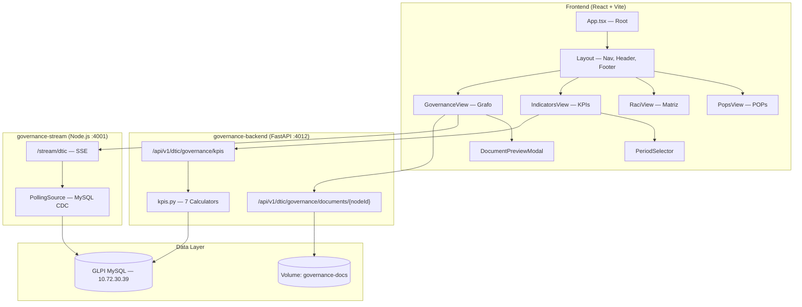

# AG-02 — Arquitetura Funcional e Técnica Ponta a Ponta

## 1. Rotas / Telas e Responsabilidades

| Rota (HashRouter) | Componente | Responsabilidade |
|----|-----------|-----------------|
| `/#/` ou `/#/governanca` | [GovernanceView](file://wsl.localhost/NVIDIA-Workbench/home/workbench/code/apps/spokes/governance/App.tsx#356-839) | Grafo interativo da estrutura normativa. Visualização hierárquica de 7 nós (Federal, Estadual, PDTI, PSI, CIG-TIC, INs, Manual). Slide-over com documentos referenciados + upload/preview. |
| `/#/indicadores` | [IndicatorsView](file://wsl.localhost/NVIDIA-Workbench/home/workbench/code/apps/spokes/governance/App.tsx#1051-1179) | Dashboard de KPIs com dados ao vivo. 7 KPIs ativos (Grupo 1) + 3 estratégicos (Grupo 2). Seletor de período. Poll a cada 30s. Cards com status semáforo (verde/amarelo/vermelho). |
| `/#/raci` | [RaciView](file://wsl.localhost/NVIDIA-Workbench/home/workbench/code/apps/spokes/governance/App.tsx#1211-1312) | Tabela RACI completa com 30 processos × 7 papéis. Cross-links para POPs e KPIs. Sticky header e coluna de processo. |
| `/#/pops` | [PopsView](file://wsl.localhost/NVIDIA-Workbench/home/workbench/code/apps/spokes/governance/App.tsx#1381-1418) | Catálogo de 9 POPs agrupados: Service (4), Transversal (4), Continuity (1). Fluxo visual de steps. Cross-links para RACI e KPIs. |

---

## 2. Componentes Principais e Fluxo de Dados



### Componentes-chave

| Componente | Linhas | Função |
|-----------|--------|--------|
| [GovernanceView](file://wsl.localhost/NVIDIA-Workbench/home/workbench/code/apps/spokes/governance/App.tsx#356-839) | 356–838 | Grafo de governança + slide-over de documentos |
| [IndicatorsView](file://wsl.localhost/NVIDIA-Workbench/home/workbench/code/apps/spokes/governance/App.tsx#1051-1179) | 1051–1178 | Dashboard KPI com period selector e SSE |
| [RaciView](file://wsl.localhost/NVIDIA-Workbench/home/workbench/code/apps/spokes/governance/App.tsx#1211-1312) | 1211–1311 | Tabela RACI com sticky columns |
| [PopsView](file://wsl.localhost/NVIDIA-Workbench/home/workbench/code/apps/spokes/governance/App.tsx#1381-1418) | 1381–1417 | Catálogo de procedimentos |
| [KpiCard](file://wsl.localhost/NVIDIA-Workbench/home/workbench/code/apps/spokes/governance/App.tsx#842-1022) | 842–1021 | Card individual de KPI com semáforo |
| [DocumentPreviewModal](file://wsl.localhost/NVIDIA-Workbench/home/workbench/code/apps/spokes/governance/App.tsx#148-355) | 148–354 | Preview inline de PDF/DOCX/XLSX/imagens |
| [Layout](file://wsl.localhost/NVIDIA-Workbench/home/workbench/code/apps/spokes/governance/App.tsx#1421-1496) | 1421–1495 | Shell com navbar, breadcrumb, footer |
| [PeriodSelector](file://wsl.localhost/NVIDIA-Workbench/home/workbench/code/apps/spokes/governance/App.tsx#1025-1050) | 1025–1049 | Dropdown de período temporal |

---

## 3. Contratos de API Consumidos

### Backend REST (`governance-backend` — porta 4012)

| Método | Endpoint | Params | Response |
|--------|---------|--------|----------|
| `GET` | `/api/v1/dtic/governance/kpis` | `?period=current_month\|last_month\|year_to_date\|last_12_months\|year_YYYY\|YYYY-MM` | `{ period, period_start, period_end, generated_at, total_tickets, kpis: { [id]: KpiValue }, errors?, performance }` |
| `GET` | `/api/v1/dtic/governance/documents/{nodeId}` | — | `GovernanceDocument[]` (`{ name, size, uploadedAt, url }`) |
| `POST` | `/api/v1/dtic/governance/documents/{nodeId}` | `multipart/form-data` ([file](file://wsl.localhost/NVIDIA-Workbench/home/workbench/code/apps/spokes/governance/Dockerfile)) | Status 200/400 |
| `DELETE` | `/api/v1/dtic/governance/documents/{nodeId}/{filename}` | — | Status 200/404 |

### SSE Stream (`governance-stream` — porta 4001)

| Endpoint | Protocolo | Payload |
|---------|----------|---------|
| `/stream/dtic` | EventSource (SSE) | `{ table, uuid, ... }` — emitido a cada CDC event |

### Autenticação (Token passthrough)
- Header: `Authorization: Bearer {glpi_session_token}`
- Token obtido via query param `?glpi_token=xxx` na URL ou `localStorage.glpi_session_token`

---

## 4. Modelo de Permissões / Acesso

| Aspecto | Implementação |
|---------|--------------|
| Autenticação | Token GLPI passado via URL ou localStorage |
| Autorização | **Sem controle granular** — qualquer token válido acessa tudo |
| Escopo DTIC | Filtro hardcoded nos grupos `[89, 90, 91, 92]` no backend |
| Multi-tenancy | Stream suporta multi-contexto (configs por tenant), mas governance frontend conecta apenas ao contexto [dtic](file://wsl.localhost/NVIDIA-Workbench/home/workbench/code/apps/spokes/governance-backend/src/services/governance/kpis.py#66-75) |

> [!WARNING]
> Não existe controle de "quem vê o quê". Qualquer usuário com token GLPI válido vê todos os KPIs e pode fazer upload/delete de documentos. A segurança depende da rede interna e do acesso ao URL.

---

## 5. Dependências Externas e Pontos de Acoplamento

| Dependência | Tipo | Ponto de Acoplamento |
|------------|------|---------------------|
| GLPI MySQL (10.72.30.39) | Database access | SQLAlchemy raw SQL queries nos 7 calculadores KPI |
| GLPI API | REST | Token passthrough, não utilizado diretamente nos KPIs |
| Volume Docker `governance-docs` | Storage | Upload/download de documentos no slide-over |
| Logo RS (`/logo_rs.png`) | Static asset | Header da aplicação |
| TailwindCSS (via CDN/build) | CSS framework | Classes utilitárias em todo o JSX |
| pdf.js (CDN worker) | Library | Preview de PDFs |
| xlsx.js | Library | Preview de planilhas Excel |
| docx-preview | Library | Preview de documentos Word |
| yet-another-react-lightbox | Library | Zoom em imagens |

---

## 6. Diagrama Textual de Fluxo de Dados

```
ENTRADA                        TRANSFORMAÇÃO                    VISUALIZAÇÃO
═══════                        ═══════════                      ════════════

GLPI MySQL                     governance-backend               Frontend React
┌──────────────┐               ┌────────────────────┐           ┌──────────────────┐
│ glpi_tickets │──────SQL──────│ calc_sla()         │──JSON───→ │ KpiCard (SLA)    │
│ glpi_groups_ │               │ calc_tma()         │           │ KpiCard (TMA)    │
│   tickets    │               │ calc_tme()         │           │ KpiCard (TME)    │
│ glpi_logs    │               │ calc_incidents()   │           │ KpiCard (Inc)    │
│ glpi_itilfol │               │ calc_reincidence() │           │ KpiCard (Reinc)  │
│ glpi_ticket  │               │ calc_volumetry()   │           │ KpiCard (Vol)    │
│   tasks      │               │ calc_changes()     │           │ KpiCard (Mudanç) │
│ glpi_changes │               └────────────────────┘           └──────────────────┘
└──────────────┘                        │
       │                              30s poll
       │                                │
       │                    ┌───────────────────┐            ┌──────────────────┐
       └───CDC polling──────│ governance-stream │───SSE────→ │ GovernanceView   │
                            │ (MySQL binlog sim)│            │ (auto-refresh    │
                            │                   │            │  documentos)      │
                            └───────────────────┘            └──────────────────┘

Volume Docker                                                ┌──────────────────┐
┌──────────────┐                                             │ DocumentPreview  │
│ /data/       │──────REST upload/download─────────────────→ │ Modal (PDF,DOCX, │
│ governance/  │                                             │  XLSX,IMG)       │
└──────────────┘                                             └──────────────────┘

constants.ts                                                 ┌──────────────────┐
┌──────────────┐                                             │ GovernanceView   │
│ governance   │                                             │ (Grafo interativo│
│ Nodes[]      │────────────client-side──────────────────── →│  com conexões)   │
│ kpis[]       │                                             │ RaciView (tabela)│
│ raciMatrix[] │                                             │ PopsView (cards) │
│ pops[]       │                                             └──────────────────┘
└──────────────┘
```
