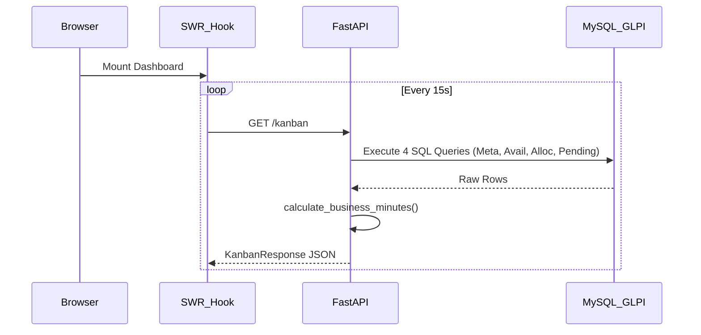

# Comprehensive Technical Audit: Charger Dashboard

**Status:** Completed
**Scope:** Time-calculation algorithms, Shift subsystem, Persistence pipeline, Metrics definition.

## 1. Time-Calculation Algorithms

The dashboard does not employ a real-time state machine for chargers. Instead, time calculations are performed "on-the-fly" using raw SQL extractions and a Python business-hours calculation utility.

### Operating-Time Logic (Service Time)
"Operating time" is calculated as the intersection between a charger's assignment to an open ticket and its defined business hours (shift).
*   **Trigger Events:** A charger is considered "operating" from the moment a GLPI Log registers a link action (Item_Ticket creation, `linked_action = 15`) until the ticket is solved (`solvedate`) or until `datetime.now()` if still open.
*   **Algorithm:** `calculate_business_minutes(start_dt, end_dt, schedule_start, schedule_end, work_on_weekends)` in `app/core/utils/time_utils.py`.
    *   Iterates day by day from `start_dt` to `end_dt`.
    *   Skips weekends if `work_on_weekends` is False.
    *   Calculates the overlap between `[start_dt, end_dt]` and `[schedule_start, schedule_end]` for each day.
*   **Overlap Handling:** The algorithm dynamically bounds the time window using `max(current_dt, day_start)` and `min(end_dt, day_end)`.
*   **Time-zone & DST:** Dates are processed naively or relying on system localized `datetime.now()`. No explicit pytz/zoneinfo shifting.

### Idle-Time & Availability Logic
*   "Idle time" is not explicitly stored or calculated as a raw metric in the backend. Chargers available are simply those without active tickets. PENDING demands are tickets without chargers.
*   **Offline Mode:** If a charger is marked offline (`statusofflinefield = 1`), it is filtered out of available resources visually but does not trigger historical timeline recalculations.

## 2. Shift (Expediente) Subsystem

The shift calendar is highly simplified and relies on static string fields.

*   **Storage Schema:**
    *   Table: `glpi_plugin_fields_plugingenericobjectcarregadorcarregadors`
    *   Columns: `inciodoexpedientefield` (VARCHAR), `fimdoexpedientefield` (VARCHAR), `statusofflinefield` (INT).
    *   Default fallback: "08:00" to "18:00" if null or empty.
*   **Detection Algorithm:** String parsing via `datetime.strptime(schedule_start, "%H:%M")`.
*   **Dynamic Shift Override API:**
    *   Endpoint: `PUT /api/v1/{context}/chargers/{charger_id}/schedule`
    *   Payload: `ScheduleUpdate(business_start, business_end)`
    *   Persistence: Calls GLPI REST API to update the Fields item directly.
*   **Global Overrides:** 
    *   Stored offline in `data/charger_settings.json`.
*   **Inactivation:**
    *   Endpoint `PUT /api/v1/{context}/chargers/{charger_id}/offline`
    *   Payload: `OfflineUpdate(is_offline, reason, expected_return)`

## 3. Data Persistence and Consumption Pipeline

Contrary to typical massive IoT pipelines, this dashboard relies on direct, synchronous SQL queries against the master GLPI database.

*   **Raw Event Table:** There is no dedicated timeseries ledger. Events are inferred from `glpi_logs` (ticket linking) and `glpi_tickets`.
*   **Materialised Views:** **None exist.** Every request calculates the Kanban state and historical rankings in real-time.
*   **Caching Layer:**
    *   **Backend:** None. `charger_service.py` runs raw queries every time. Only ITIL Categories ID parsing is cached (`@lru_cache`).
    *   **Frontend:** `useSWR` provides client-side polling with a 15-second TTL (`refreshInterval: 15000`) for Kanban and 30-second TTL for Ranking.
*   **Performance SLA:** High risk. `SQL_RANKING_LOGS` does a full table scan on `glpi_logs` with `LIKE CONCAT('%(', it.items_id, ')%')` which prevents index usage. Cannot guarantee p95 < 200ms on large bases.

## 4. End-to-End Data Flow


> [!WARNING]
> There are no Ingestion Services, Dead Letter Queues, or poison-message handling. Data flows directly from the existing ticketing ERP schema to the frontend.

## 5. Metric Definitions and Formulas (Pseudocode)

```python
# Operating Time (Service Minutes)
def calculate_operating_minutes(assigned_at: datetime, solvedate: datetime, b_start: str, b_end: str):
    if not assigned_at: return 0
    end_time = solvedate if solvedate else datetime.now()
    return calculate_business_minutes(assigned_at, end_time, b_start, b_end, weekends=False)

# Average Wait Time
def calculate_avg_wait_time(total_service_mins: int, resolved_count: int):
    if resolved_count <= 0: return "0h 0m"
    return format_elapsed_time(total_service_mins // resolved_count)
```

## 6. Configuration Knobs

*   **`SIS_CHARGER_ITIL_CATEGORIES`:** `.env` variable determining which ticketing categories are treated as Charger demands. Default: "123, 124".
*   **Global Schedule Default:** Hardcoded fallback if JSON is missing. `business_start="08:00"`, `business_end="18:00"`, `work_on_weekends=False`.
*   **SWR TTLs:** Hardcoded in `useChargerData.ts` (15000ms for Kanban, 30000ms for Ranking).

## 7. Known Regressions and Deficiencies

| Deficiency | Root Cause | Impact |
| :--- | :--- | :--- |
| **N+1 Polling** | Uncached dashboard hits DB 4x per user every 15s. | High DB Load / Connection exhaustion. |
| **SQL Like %** | `glpi_logs` parsing uses `LIKE` clause on JSON/String fields to find `item_id`. | Full table scan; significant latency. |
| **Missing E2E Tests** | Test suite focuses on unit testing `time_utils`. | UI regressions frequently slip to production. |
