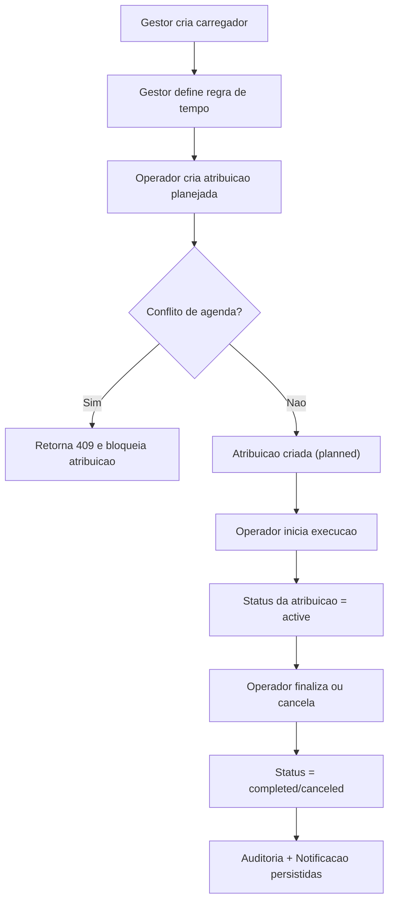
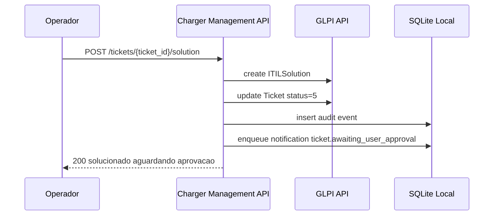

# Diagrama de Fluxo - Charger Management v2

## Fluxo principal (operacional)

```mermaid
flowchart TD
    A["Gestor cria carregador"] --> B["Gestor define regra de tempo"]
    B --> C["Operador cria atribuicao planejada"]
    C --> D{"Conflito de agenda?"}
    D -- "Sim" --> E["Retorna 409 e bloqueia atribuicao"]
    D -- "Nao" --> F["Atribuicao criada (planned)"]
    F --> G["Operador inicia execucao"]
    G --> H["Status da atribuicao = active"]
    H --> I["Operador finaliza ou cancela"]
    I --> J["Status = completed/canceled"]
    J --> K["Auditoria + Notificacao persistidas"]
```

## Fluxo GLPI de solucao

```mermaid
sequenceDiagram
    participant OP as Operador
    participant API as Charger Management API
    participant GLPI as GLPI API
    participant DB as SQLite Local

    OP->>API: POST /tickets/{ticket_id}/solution
    API->>GLPI: create ITILSolution
    API->>GLPI: update Ticket status=5
    API->>DB: insert audit event
    API->>DB: enqueue notification ticket.awaiting_user_approval
    API-->>OP: 200 solucionado aguardando aprovacao
```
