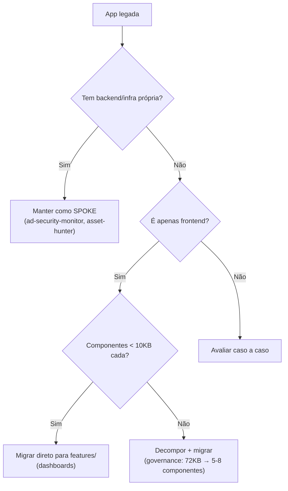
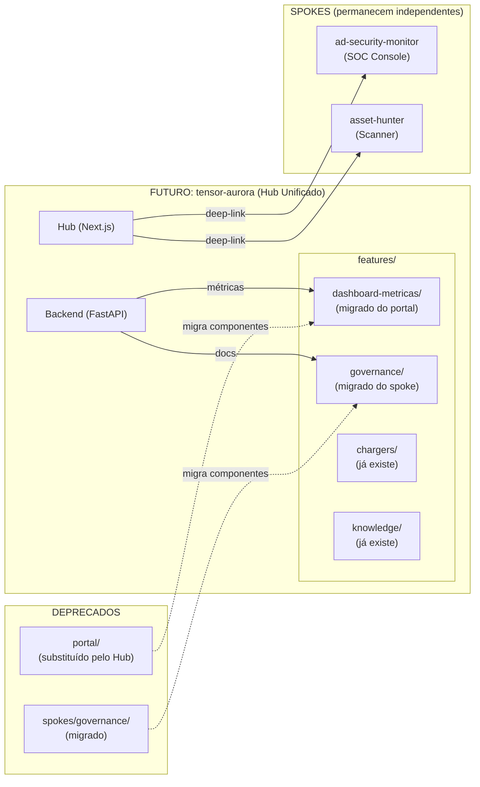

# 📐 Consolidação Definitiva — Plano Mestre de Evolução Arquitetural

> **Data**: 2026-03-09 | **Versão**: 1.0  
> **Base**: 5 documentos de estudo + investigação do ecossistema legado  
> **Status**: Todos os gaps críticos resolvidos — pronto para planejamento de implementação

---

## 1. Mapa Completo do Ecossistema — Duas Bases de Código

### 1.1 Base Atual: `tensor-aurora/` (Hub DTIC & SIS)

O Hub unificado que estamos evoluindo. Já roda em produção.

| Componente | Tech Stack | Porta | Status |
|-----------|-----------|:-----:|:------:|
| **Frontend (Next.js)** | Next.js + React + Zustand + SWR | — | ✅ Produção |
| **Backend (FastAPI)** | Python + FastAPI + httpx | — | ✅ Produção |

**Funcionalidades no Hub**:
- ✅ Central de Chamados (Kanban) — todas os contextos
- ✅ Smart Search — todas os contextos
- ✅ Gestão de Carregadores — SIS only
- ✅ Base de Conhecimento — DTIC
- ✅ Formulário Dinâmico — todas

### 1.2 Base Legada: WSL `~/code/apps/` (Ecossistema Original)

Monorepo com taxonomia `portal/platform/spokes`:

```
~/code/apps/
├── portal/                     ← React+Vite (DASHBOARDS)
│   └── src/modules/
│       ├── dashboard/          ← 📊 DASHBOARDS DE MÉTRICAS
│       │   ├── Dashboard.tsx           (26KB — Dashboard principal DTIC)
│       │   ├── MaintenanceDashboard.tsx (6.4KB — Manutenção)
│       │   ├── ConservationDashboard.tsx(6.5KB — Conservação)
│       │   ├── ArchitectureDashboard.tsx(9.5KB — Inconsistências)
│       │   ├── InconsistencyMonitor.tsx (9.4KB)
│       │   ├── TechnicianModal.tsx      (10KB)
│       │   ├── TimelineItem.tsx         (5.4KB)
│       │   ├── Charts/                  (Componentes de gráficos)
│       │   ├── Modals/
│       │   └── hooks/
│       │       └── useDashboardData.ts  (11KB — Data fetching)
│       ├── forms/              ← Formulários
│       ├── hub/                ← Layout/Shell
│       ├── operations/         ← Operações
│       ├── search/             ← Busca
│       ├── services/           ← Services layer
│       └── vision/             ← Role selector
│
├── platform/                   ← APIS E SERVIÇOS
│   ├── backend/                ← FastAPI (métricas + auth + governança)
│   └── ouvinte/                ← Node.js/TS (CDC/SSE — tempo real)
│
├── spokes/                     ← APPS INDEPENDENTES
│   ├── governance/             ← React+Vite (Governança DTIC)
│   │   └── App.tsx             (72KB! — 🔴 Monolito único arquivo)
│   │   └── constants.ts       (15KB — dados/config)
│   └── ad-security-monitor/   ← Observabilidade/SOC
│       └── platform/
│           ├── frontend/       ← React+Vite (5 telas SOC)
│           ├── src/            ← Python API backend
│           ├── ingestion_ad/   ← Pipeline AD
│           ├── ingestion_glpi/ ← Pipeline GLPI
│           ├── ingestion_syslog/ ← Pipeline Syslog
│           ├── db/             ← Schema
│           └── config/
│
├── asset-hunter/               ← Scanner de Ativos
│   ├── backend/                ← Python API
│   ├── engine/                 ← Scanner engine
│   └── frontend/               ← React+Vite
│
├── tickets-backend/            ← NestJS (sistema de tickets alternativo)
└── tickets-mobile/             ← Expo (React Native)
```

### 1.3 Docker-Compose — Mapa de Portas

| Container | Build | Porta | Rede |
|-----------|-------|:-----:|:----:|
| `glpi-backend` | platform/backend | 4012 | apps_network |
| `glpi-cdc` | platform/ouvinte | 4001 | apps_network |
| `hub-dtic` | portal/ | 4004 | apps_network |
| `hub-sis` | portal/ | 4005 | apps_network |
| `gestao-carregadores` | portal/ | 4020 | apps_network |
| `governance-dtic` | spokes/governance | 4010 | apps_network |
| `ad-monitor-frontend` | spokes/ad-security-monitor/platform/frontend | 5175 | apps_network + platform-net |
| `tickets-backend` | tickets-backend | 3005 | apps_network |
| `tickets-mobile` | tickets-mobile | 8082 | apps_network |
| `tickets-db` | postgres:15-alpine | 5433 | apps_network |

> [!IMPORTANT]
> O **portal** é instanciado 3x com variáveis de ambiente diferentes (`VITE_CONTEXT=dtic`, `VITE_CONTEXT=sis`, `VITE_STANDALONE=true`). Isso confirma que é um **único codebase** parametrizado por contexto — exatamente o padrão que queremos no Hub.

---

## 2. Gap 1 Resolvido ✅ — Tech Stack dos Dashboards

| App | Framework | Linguagem | Estratégia de Migração |
|-----|-----------|-----------|----------------------|
| **Dashboards (portal/)** | React + Vite + SWR | TypeScript | 🟢 **Mecânica** — copiar componentes para `features/dashboard-metricas/` |
| **Governança (governance/)** | React + Vite + TailwindCSS | TypeScript | 🟡 **Decomposição** — App.tsx 72KB precisa ser quebrado em componentes |
| **SOC/Observability (ad-security-monitor/)** | React(Vite) + Python + Postgres | TS + Python | 🔴 **Complexa** — tem backend próprio + 3 pipelines de ingestão. Manter como spoke |
| **Asset Hunter** | React(Vite) + Python | TS + Python | 🟡 **Avaliar** — potencialmente consolidar com SOC |

### Regra de Decisão



### Detalhes da Migração — Dashboards de Métricas

Os dashboards do `portal/src/modules/dashboard/` já são **componentes React isolados**:

| Arquivo | Tamanho | Migra para | Observação |
|---------|:-------:|-----------|------------|
| [Dashboard.tsx](file://wsl.localhost/NVIDIA-Workbench/home/workbench/code/apps/portal/src/modules/dashboard/components/Dashboard.tsx) | 26KB | `features/dashboard-metricas/DticDashboard.tsx` | Dashboard principal DTIC |
| [MaintenanceDashboard.tsx](file://wsl.localhost/NVIDIA-Workbench/home/workbench/code/apps/portal/src/modules/dashboard/components/MaintenanceDashboard.tsx) | 6.4KB | `features/dashboard-metricas/MaintenanceDashboard.tsx` | Já separado |
| [ConservationDashboard.tsx](file://wsl.localhost/NVIDIA-Workbench/home/workbench/code/apps/portal/src/modules/dashboard/components/ConservationDashboard.tsx) | 6.5KB | `features/dashboard-metricas/ConservationDashboard.tsx` | Já separado |
| [ArchitectureDashboard.tsx](file://wsl.localhost/NVIDIA-Workbench/home/workbench/code/apps/portal/src/modules/dashboard/components/ArchitectureDashboard.tsx) | 9.5KB | Avaliar se ainda é necessário | — |
| [InconsistencyMonitor.tsx](file://wsl.localhost/NVIDIA-Workbench/home/workbench/code/apps/portal/src/modules/dashboard/components/InconsistencyMonitor.tsx) | 9.4KB | Avaliar merger com Dashboard | — |
| [useDashboardData.ts](file://wsl.localhost/NVIDIA-Workbench/home/workbench/code/apps/portal/src/modules/dashboard/hooks/useDashboardData.ts) | 11KB | `features/dashboard-metricas/hooks/` | Hook de data fetching |
| `Charts/` | — | `features/dashboard-metricas/components/charts/` | Componentes de visualização |

> [!TIP]
> **A migração dos dashboards é a mais fácil de todo o projeto.** São componentes React puros com hook de dados. Não dependem de backend próprio — usam o mesmo `platform/backend` (FastAPI) que já existe.

---

## 3. Especificação das Métricas por Dashboard

### 3.1 Métricas Comuns (DTIC + Manutenção + Conservação)

| Métrica | Descrição | Filtro por Data? |
|---------|-----------|:-------:|
| **Totais de Status Geral** | Cards com contagem por status (Novo, Em Andamento, Pendente, Resolvido, Fechado) | ✅ Sim |
| **Lista de Tickets Novos** | Tabela/cards dos tickets mais recentes com status "Novo" | ❌ **Nunca** — sempre total geral |
| **Ranking de Técnicos** | Top técnicos por volume de resolução no período | ✅ Sim |
| **Total por Categoria** | Barras/pizza agrupando tickets por categoria de chamado | ✅ Sim |
| **Total por Entidade** | Barras agrupando tickets por entidade/setor solicitante | ✅ Sim |

### 3.2 Métricas Exclusivas DTIC

| Métrica | Descrição | Filtro por Data? |
|---------|-----------|:-------:|
| **Totais por Nível N1** | Volume e status de atendimentos de primeiro nível | ✅ Sim |
| **Totais por Nível N2** | Volume e status de atendimentos de segundo nível | ✅ Sim |
| **Totais por Nível N3** | Volume e status de atendimentos de terceiro nível | ✅ Sim |
| **Totais por Nível N4** | Volume e status de atendimentos de quarto nível | ✅ Sim |

### 3.3 Regras de Filtragem

| Regra | Aplicação |
|-------|-----------|
| **Date Range Picker** | Todos os dashboards. Range livre, qualquer período. |
| **Exceção: Tickets Novos** | Em QUALQUER dashboard, os totais de tickets novos **NUNCA** filtram por data. Sempre exibem o total acumulado. |
| **Filtro Base** | `WHERE is_deleted = 0 AND is_active = 1` — aplicado em **todas** as queries. |
| **Escopo por Contexto** | Manutenção vê **apenas** manutenção. Conservação vê **apenas** conservação. DTIC vê tudo da DTIC. |

### 3.4 Uso Físico dos Dashboards

| Contexto | Setup Físico | Conteúdo |
|----------|-------------|----------|
| **DTIC** | 2 TVs de 60" lado a lado | TV1: Dashboard de métricas de tickets · TV2: Dados de rede e infra |
| **Manutenção** | 1 TV de 60" | Dashboard de métricas da manutenção |
| **Conservação** | 1 TV de 60" (ao lado da manutenção) | Dashboard de métricas da conservação |

---

## 4. Gap 2 Resolvido ✅ — AD/LDAP + Grupos GLPI

Do screenshot do GLPI de produção (`cau.ppiratini.intra.rs.gov.br`), identificamos:

- **"Regras para associar permissões a um usuário"** — regras de autorização LDAP existem e estão ativas
- **"Regras para importação a vínculo de equipamentos"** — importação de ativos
- **"Regras de negócios para chamados/ativos"** — workflow rules

### Diagnóstico

O GLPI de produção **tem regras de autorização LDAP** configuradas. Isso significa que quando um usuário se autentica via AD, o GLPI automaticamente atribui perfis e entidades baseado em regras (geralmente por OU do AD ou atributo LDAP).

### Impacto para Abordagem C (Grupos Hub-App-*)

Os grupos `Hub-App-*` que criaremos são **grupos internos do GLPI**, não grupos do AD. Portanto:

| Cenário | Comportamento |
|---------|:---:|
| Usuário faz login via AD | ✅ Perfil + Entidade atribuídos automaticamente pela regra LDAP |
| Vinculação a grupo Hub-App-* | ⚙️ **Manual** — via Admin Panel da nossa interface ou interface nativa do GLPI |
| Sync automático AD → GLPI Groups | ❌ Não se aplica — Hub-App-* são grupos GLPI, não AD |

### Conclusão

A gestão de acesso a aplicações (grupos `Hub-App-*`) será feita pelo **nosso Admin Panel** ou pela interface nativa do GLPI. Isso é operacionalmente aceitável porque:
1. A adição/remoção de apps é rara (não é todo dia)
2. O Admin Panel permite bulk operations
3. Alternativa futura: criar regra LDAP que mapeia OU do AD → grupo Hub-App-* automaticamente

---

## 5. Observabilidade — Estratégia para Spokes Complexos

### 5.1 AD Security Monitor (SOC Console)

**Decisão: Manter como SPOKE** — tem infraestrutura própria significativa:
- Backend Python com 3 pipelines de ingestão (AD, GLPI, Syslog)
- Banco PostgreSQL próprio
- Frontend Vite com 5 telas: Busca Global, Status de Cobertura, Monitoramento de Identidades, Ativos Operacionais, Indicadores Críticos, SOC Console

**Integração com Hub**: Via `VITE_AD_MONITOR_URL` + deep-links. No manifest, vira um item de menu que abre em nova aba ou iframe.

### 5.2 Asset Hunter

**Decisão: Avaliar consolidação com SOC** — scanner de rede com engine Python + frontend. Pode se tornar uma tela dentro do SOC ou permanecer independente.

**Integração com Hub**: Mesmo padrão — URL + deep-link via manifest.

### 5.3 Governança

**Decisão: Migrar para módulo do Hub** — é apenas frontend (App.tsx 72KB + constants.ts 15KB), sem backend próprio. Usa o FastAPI (`platform/backend`) como backend de dados.

**Estratégia de migração**:
1. Decompor o [App.tsx](file://wsl.localhost/NVIDIA-Workbench/home/workbench/code/apps/portal/src/App.tsx) (72KB) em 5-8 componentes isolados
2. Mover para `features/governance/` no Hub
3. Hook de dados já pode ser adaptado do padrão SWR do Hub
4. O endpoint `governance-dtic` do docker-compose.yml será deprecado

---

## 6. Relação entre os Dois Codebases



---

## 7. Roadmap Definitivo — 5 Fases

### Fase 0 — Rede de Segurança (1-2 dias)

| Ação | Por quê | Esforço |
|------|---------|:-------:|
| Criar testes para [resolve_hub_roles()](file:///c:/Users/jonathan-moletta/.gemini/antigravity/playground/tensor-aurora/app/services/auth_service.py#53-109) e [build_login_response()](file:///c:/Users/jonathan-moletta/.gemini/antigravity/playground/tensor-aurora/app/services/auth_service.py#111-162) | Rede de segurança antes de refatorar auth | ~4h |
| Verificar regras LDAP no GLPI de produção (detalhes) | Confirmar comportamento exato do sync | ~1h |

### Fase 1 — Foundation: Context Registry + Manifests (1 semana)

| Ação | Arquivos afetados | Impacto |
|------|------------------|---------|
| Criar `ContextRegistry` + `contexts.yaml` | `app/core/context_registry.py` (novo) | Zero impacto funcional |
| Migrar if/elif para registry | [config.py](file:///c:/Users/jonathan-moletta/.gemini/antigravity/playground/tensor-aurora/app/config.py), [health.py](file:///c:/Users/jonathan-moletta/.gemini/antigravity/playground/tensor-aurora/app/routers/health.py), [session_manager.py](file:///c:/Users/jonathan-moletta/.gemini/antigravity/playground/tensor-aurora/app/core/session_manager.py), [database.py](file:///c:/Users/jonathan-moletta/.gemini/antigravity/playground/tensor-aurora/app/core/database.py) | Mesma funcionalidade, sem hardcode |
| Mover profile_maps para YAML | [auth_service.py](file:///c:/Users/jonathan-moletta/.gemini/antigravity/playground/tensor-aurora/app/services/auth_service.py) | Elimina `_DTIC_PROFILE_MAP` e `_SIS_PROFILE_MAP` |
| Criar `context-registry.ts` + `CONTEXT_MANIFESTS[]` | `web/src/lib/context-registry.ts` (novo) | Zero impacto funcional |
| Refatorar selector, sidebar, layout | [selector/page.tsx](file:///c:/Users/jonathan-moletta/.gemini/antigravity/playground/tensor-aurora/web/src/app/selector/page.tsx), [AppSidebar.tsx](file:///c:/Users/jonathan-moletta/.gemini/antigravity/playground/tensor-aurora/web/src/components/ui/AppSidebar.tsx), [layout.tsx](file:///c:/Users/jonathan-moletta/.gemini/antigravity/playground/tensor-aurora/web/src/app/layout.tsx) | Renderiza do manifest |

### Fase 1.5 — Permissões App-Level (2-3 dias)

| Ação | Mudança | Impacto |
|------|---------|---------|
| Adicionar resolução `app_access[]` via grupos Hub-App-* | [auth_service.py](file:///c:/Users/jonathan-moletta/.gemini/antigravity/playground/tensor-aurora/app/services/auth_service.py) (+30 linhas) | Adiciona `app_access` ao login |
| Adicionar `app_access` ao [AuthMeResponse](file:///c:/Users/jonathan-moletta/.gemini/antigravity/playground/tensor-aurora/web/src/store/useAuthStore.ts#24-35) | Backend schema + [useAuthStore.ts](file:///c:/Users/jonathan-moletta/.gemini/antigravity/playground/tensor-aurora/web/src/store/useAuthStore.ts) | Novo campo no state |
| Criar `ContextGuard` | `web/src/features/shared/auth/ContextGuard.tsx` (novo) | Proteção de rota declarativa |
| Criar grupos Hub-App-* no GLPI produção | Via interface GLPI | Infraestrutura permissional |

### Fase 2 — Migração de Dashboards (2-3 semanas)

| Ação | Origem | Destino | Complexidade |
|------|--------|---------|:------:|
| Migrar Dashboard DTIC | `portal/src/modules/dashboard/Dashboard.tsx` | `web/src/features/dashboard-metricas/` | 🟢 Baixa |
| Migrar Dashboard Manutenção | `portal/.../MaintenanceDashboard.tsx` | Mesmo feature module | 🟢 Baixa |
| Migrar Dashboard Conservação | `portal/.../ConservationDashboard.tsx` | Mesmo feature module | 🟢 Baixa |
| Migrar [useDashboardData.ts](file://wsl.localhost/NVIDIA-Workbench/home/workbench/code/apps/portal/src/modules/dashboard/hooks/useDashboardData.ts) | Hook de data fetching | Adaptar para API do Hub | 🟡 Média |
| Criar endpoint de métricas no Hub backend | Pode reutilizar `platform/backend` | `app/routers/metrics.py` | 🟡 Média |
| Migrar Governança | [spokes/governance/App.tsx](file://wsl.localhost/NVIDIA-Workbench/home/workbench/code/apps/spokes/governance/App.tsx) (72KB) | `web/src/features/governance/` | 🟡 Média (decomposição) |

### Fase 3 — Admin Panel + Refinamentos (2-3 semanas)

| Ação | Tipo |
|------|------|
| Backend: 9 endpoints de gestão de permissões | Novo módulo `app/routers/admin.py` |
| Frontend: Interface de gestão de acessos | Novo feature `features/admin/` |
| Integrar spokes via deep-links no manifest | Config no `CONTEXT_MANIFESTS` |
| Otimizar para exibição em TVs (auto-refresh, fullscreen) | Polish |

---

## 8. O Que NÃO Fazer (Anti-Patterns)

| ❌ Não fazer | ✅ Fazer em vez disso |
|-------------|---------------------|
| Reescrever os dashboards do zero | Migrar componentes React existentes |
| Tentar absorver o SOC dentro do Hub | Manter como spoke com deep-link |
| Implementar tudo de uma vez | Fases incrementais, cada uma entrega valor |
| Criar monorepo Turborepo | Monólito extensível com features isoladas |
| Refatorar sem testes | Fase 0 cria rede de segurança primeiro |

---

## 9. Resposta Final: Temos Tudo Para Começar?

### ✅ Sim. Todos os gaps críticos estão resolvidos.

| Gap | Status | Resolução |
|-----|:------:|-----------|
| Tech stack dos dashboards | ✅ | React+Vite — migração mecânica |
| AD/LDAP × Grupos Hub-App-* | ✅ | Grupos GLPI manuais via Admin Panel |
| Roadmap fragmentado | ✅ | Unificado em 5 fases acima |
| Auth sem testes | ⏳ | Fase 0 resolve |
| useAuthStore sem app_access | ⏳ | Fase 1.5 resolve |

### O que falta é APENAS a última decisão do usuário: "Aprovado, vamos começar pela Fase 0."
