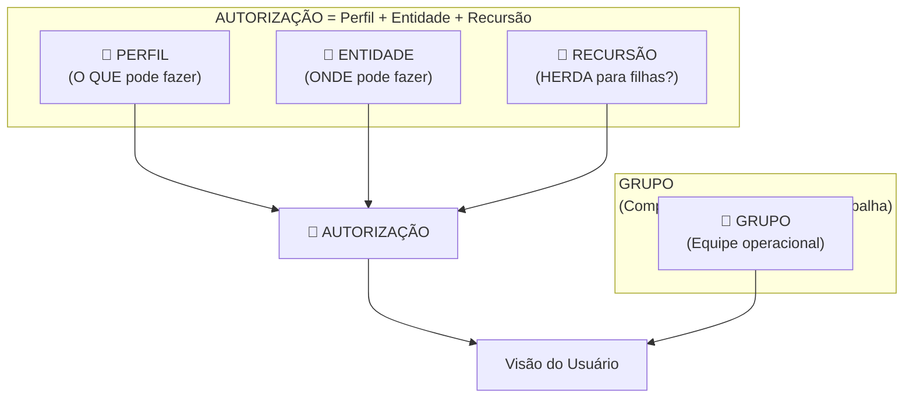
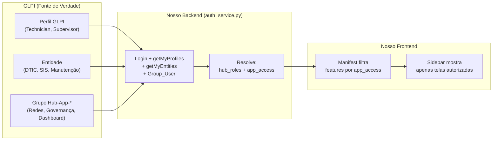

# 🔐 Estudo Arquitetural — Permissões & Matriz de Acessos do GLPI

> **Data**: 2026-03-09 | **Sandbox**: `testecau.us4.glpi-network.cloud` (45 dias)  
> **Escopo**: Dissecação da arquitetura permissional GLPI + PoC via API REST

---

## 1. Dissecação da Arquitetura GLPI: Entidades × Grupos × Perfis

### 1.1 O Modelo Mental — A "Tríade Permissional"

O GLPI opera com **3 conceitos distintos** que juntos formam a matriz de controle de acesso:



| Conceito | Papel na Arquitetura | Analogia |
|----------|---------------------|----------|
| **Perfil** (Profile) | Define **o que** o usuário pode fazer — permissões CRUD granulares por objeto (tickets, ativos, config). É a "carteira de habilitação". | `SELECT permissions FROM profile WHERE id = X` |
| **Entidade** (Entity) | Define **onde** o usuário pode atuar — segmenta dados por departamento/unidade. É o "território jurisdicional". Hierárquica (pai → filhos). | `WHERE entity_id IN (...)` — filtra a visibilidade de dados |
| **Grupo** (Group) | Define **com quem** o usuário trabalha — equipe operacional de atribuição de tickets. **NÃO controla permissões CRUD**. | Lista de distribuição de trabalho |
| **Autorização** (Authorization) | O **cruzamento** de Perfil × Entidade × Recursão. É a concessão efetiva de acesso. Tabela `Profile_User`. | `GRANT profile TO user ON entity [RECURSIVE]` |

> [!IMPORTANT]
> **Confusão mais comum**: Grupos **não concedem nem restringem permissões de acesso** a funcionalidades. Grupos definem **equipes de trabalho** para atribuição de tickets. A permissão real vem exclusivamente de **Perfil + Entidade**.

### 1.2 Hierarquia e Herança de Entidades

Entidades formam uma **árvore** com herança descendente controlada por um flag:

```
Root Entity (id=0)
└── Casa Civil RS (id=1)
    ├── DTIC (id=2)
    │   ├── App Redes (id=4)
    │   └── App Gestão KPI (id=5)
    └── SIS (id=3)
        ├── Manutenção (id=6)
        └── Conservação (id=7)
```

**Regras de herança:**
- **`is_recursive = 1`** (flag R): O perfil vale para a entidade E para **todas as filhas**
- **`is_recursive = 0`**: O perfil vale **apenas** para aquela entidade específica
- **`D = Dynamic`**: A autorização veio de uma **Regra de Autorização** automática (LDAP/AD sync). Será recalculada no próximo login.

**Exemplo prático** (confirmado via API):
```
User "admin" tem:
  Profile_User: {
    users_id: 2,
    profiles_id: 4 (Super-Admin),
    entities_id: 0 (Root),
    is_recursive: 1          ← Acesso a TODAS as entidades
  }
```

### 1.3 Como o GLPI Calcula o Acesso Efetivo

Quando um usuário faz login:

1. **Busca Profile_User**: `SELECT * FROM glpi_profiles_users WHERE users_id = X`
2. **Expande Recursão**: Para cada entrada com `is_recursive=1`, expande para todas as entidades filhas
3. **Monta** `glpiactiveentities_string`: Lista de IDs de entidades acessíveis (usado em `WHERE entities_id IN (...)`)
4. **Monta** `glpiprofiles`: Dict `{profile_id: {name, entities: [{id, name, is_recursive}]}}` acessível via `getMyProfiles`
5. **Perfil ativo** = o primeiro perfil da lista (ou o último usado), definindo as permissões CRUD da sessão
6. **Troca de perfil**: Via `changeActiveProfile` o usuário alterna entre perfis (e, consequentemente, entre permissões)

> [!NOTE]
> Um mesmo usuário pode ter **múltiplos perfis em entidades diferentes**. Exemplo: "Técnico" na DTIC + "Observador" no SIS. Ao alternar, o contexto de permissão muda completamente.

---

## 2. Mapeamento da API REST para Gestão Permissional

### 2.1 Endpoints Essenciais

| Endpoint | Método | Uso |
|----------|--------|-----|
| `/initSession` | GET | Inicia sessão com user_token + app_token |
| `/getMyProfiles` | GET | Retorna perfis do usuário logado com entidades vinculadas |
| `/getMyEntities` | GET | Retorna entidades acessíveis da sessão ativa |
| `/getFullSession` | GET | Retorna sessão completa (glpiprofiles, glpiactiveprofile, entities) |
| `/changeActiveProfile` | POST | Alterna perfil ativo do usuário |
| `/changeActiveEntities` | POST | Alterna entidade ativa (afeta filtros de dados) |
| `/Profile` | GET/POST | CRUD de perfis |
| `/Entity` | GET/POST | CRUD de entidades |
| `/Group` | GET/POST | CRUD de grupos |
| `/Profile_User` | GET/POST | **Vinculação** perfil ↔ usuário ↔ entidade |
| `/Group_User` | GET/POST | **Vinculação** grupo ↔ usuário |
| `/User` | GET/POST | CRUD de usuários |

### 2.2 Payloads Reais Testados no Sandbox

#### Iniciar Sessão
```bash
curl -H "App-Token: xpvj0QBuDibmNDQPGTo0IjYREeL75gdi6o0607Bx" \
     -H "Authorization: user_token SrUQM8oPRwiaLrOOmRY4rq9eQr2pDx1rahUWHcTC" \
     "https://testecau.us4.glpi-network.cloud/apirest.php/initSession"
# Response: {"session_token":"v80r6vdofu0utnk9997kehuhiv"}
```

#### Consultar Perfis do Usuário (getMyProfiles)
```bash
curl -H "App-Token: ..." -H "Session-Token: ..." \
     "https://.../apirest.php/getMyProfiles"
# Response:
{
  "myprofiles": [{
    "id": 4,
    "name": "Super-Admin",
    "entities": [{
      "id": 0,
      "name": "Root entity",
      "is_recursive": 1
    }]
  }]
}
```

#### Criar Entidade Filha
```bash
curl -X POST -H "Content-Type: application/json" \
     -H "App-Token: ..." -H "Session-Token: ..." \
     -d '{"input":{"name":"DTIC","entities_id":1}}' \
     "https://.../apirest.php/Entity"
# Response: {"id":2,"message":"Item successfully added: DTIC"}
```

#### Criar Grupo Vinculado a Entidade
```bash
curl -X POST -d '{"input":{
  "name":"N3 Redes",
  "entities_id":2,
  "is_recursive":1
}}' "https://.../apirest.php/Group"
# Response: {"id":1,"message":"Item successfully added: N3 Redes"}
```

#### Vincular Usuário a Grupo
```bash
curl -X POST -d '{"input":{
  "users_id":2,
  "groups_id":1
}}' "https://.../apirest.php/Group_User"
# Response: {"id":1,"message":"Item successfully added"}
```

#### Vincular Perfil ↔ Usuário ↔ Entidade (Autorização)
```bash
curl -X POST -d '{"input":{
  "users_id":7,
  "profiles_id":9,
  "entities_id":4,
  "is_recursive":0
}}' "https://.../apirest.php/Profile_User"
# Cria a AUTORIZAÇÃO: user 7 tem perfil Hub-Monitor na entidade App Redes
```

#### Mudar Entidade Ativa (para criar sub-entities)
```bash
curl -X POST -d '{"entities_id":0,"is_recursive":true}' \
     "https://.../apirest.php/changeActiveEntities"
# Response: true
```

### 2.3 Informação Retornada pelo getFullSession

O endpoint `getFullSession` é o **mais rico** — retorna toda a sessão GLPI incluindo:

```json
{
  "session": {
    "glpiID": 2,
    "glpiname": "admin",
    "glpiprofiles": {
      "4": {
        "name": "Super-Admin",
        "entities": [{"id": 0, "name": "Root entity", "is_recursive": 1}]
      }
    },
    "glpiactiveprofile": {
      "id": 4,
      "name": "Super-Admin",
      "interface": "central",
      "ticket": 15519,
      // ... ~200 campos de permissão CRUD bitmask
    },
    "glpiactiveentities_string": "'0'"
  }
}
```

> [!TIP]
> O campo `glpiactiveprofile` contém **todas as permissões CRUD** como bitmasks. Cada bit corresponde a uma permissão (Read=1, Update=2, Create=4, Delete=8, Purge=16). Exemplo: `"ticket": 15519` = todas as permissões de ticket.

---

## 3. Modelagem Ideal — Solucionando o Problema DTIC

### 3.1 O Problema Atual

```
DTIC tem 3 tipos de usuário:
├── Gestor: acessa Dashboard KPI + App Redes + Admin
├── Técnico N3 Redes: acessa APENAS App Redes
└── Técnico Suporte: acessa Dashboard + Tickets (mas NÃO App Redes)

Solução improvisada: criaram perfis "app-monitor" e "app adm"
Problema: poluiu a lista de perfis GLPI com conceitos que são da nossa app
```

### 3.2 As 3 Abordagens Possíveis

#### Abordagem A: Entidades-como-Aplicações
Cada aplicação externa é uma **sub-entidade** do departamento. O acesso é controlado por qual entidade o perfil cobre.

```
Root Entity
└── Casa Civil RS
    └── DTIC
        ├── DTIC > Hub Apps                    ← Entidade "guarda-chuva"
        │   ├── DTIC > Hub Apps > Redes        ← Acesso ao App Redes
        │   └── DTIC > Hub Apps > Governança   ← Acesso ao App Governança/KPI 
        └── DTIC > Operação                    ← Entidade para tickets normais
```

| Prós | Contras |
|------|---------|
| ✅ Usa mecanismo nativo do GLPI (herança de entidades) | ⚠️ Entidades são pensadas para separar DADOS, não apps. Todos os tickets ficariam segregados por entidade |
| ✅ Um perfil "Técnico" serve para todos, filtrado pela entidade | ❌ Se o técnico de redes criar um ticket, ele ficará na entidade "Redes", isolado dos demais |
| ✅ `getMyEntities` retorna exatamente quais apps o user pode ver | ❌ Distorce o modelo conceitual do GLPI |

**Veredito**: ⚠️ Funciona tecnicamente, mas **sobre-abusa** o conceito de Entity. Cria silos de dados indesejados.

---

#### Abordagem B: Perfis Customizados por Capacidade
Cada "nível de acesso" a apps externos é um **perfil dedicado** no GLPI.

```
Perfis:
├── Hub-Monitor        (id=9)  → Acesso: App Redes
├── Hub-Gestor         (id=10) → Acesso: Dashboard KPI + Admin
├── Hub-TecRedes       (id=11) → Acesso: App Redes + Tickets
├── Hub-TecSuporte     (id=12) → Acesso: Dashboard + Tickets
└── (perfis padrão GLPI continuam intactos)
```

| Prós | Contras |
|------|---------|
| ✅ Semântica clara: perfil = capacidade funcional | ⚠️ Prolifera perfis (N apps × M níveis = muitos perfis) |
| ✅ `getMyProfiles` retorna exatamente quais perfis o user tem | ⚠️ Precisa manter sincronizados os perfis GLPI com as features da app |
| ✅ Não afeta a segregação de dados existente | ❌ Perfis GLPI carregam ~200 campos de permissão CRUD. Criar perfis só para controlar apps externos é overhead |

**Veredito**: ⚠️ Funcional, mas gera **explosão de perfis** e usa um mecanismo pesado (200 campos) para algo simples.

---

#### Abordagem C: Grupos como Tag de Capacidade ⭐ (RECOMENDADA)

Cada **aplicação** é representada por um **grupo**. O usuário é adicionado aos grupos cujos apps ele pode acessar. A **lógica de controle de acesso** fica no nosso backend, não no GLPI.

```
Grupos (entities_id=2 → DTIC):
├── Hub-App-Redes         (id=1) → Quem está neste grupo pode ver App Redes
├── Hub-App-Governanca    (id=5) → Quem está neste grupo pode ver App Governança
├── Hub-App-Dashboard     (id=6) → Quem está neste grupo pode ver Dashboard Métricas
└── N3 Redes              (id=7) → Grupo operacional (atribuição de tickets)

Perfis (mantidos os nativos):
├── Technician (id=6) → Permissões CRUD de técnico padrão
├── Supervisor (id=7) → Permissões CRUD de supervisor
└── Self-Service (id=1) → Permissões mínimas
```

**Modelo de autorização**:

| Conceito | Controlado por | Consulta API |
|----------|---------------|--------------|
| Permissões CRUD (tickets, ativos, config) | **Perfil** GLPI nativo (Technician, Supervisor, etc.) | `getMyProfiles` |
| Departamento / Escopo de dados | **Entidade** GLPI (DTIC, SIS, Manutenção) | `getMyEntities` |  
| Acesso a aplicações externas | **Grupo** GLPI (Hub-App-Redes, Hub-App-Governanca) | `Group_User` + `Group` API |
| Equipe de trabalho (atribuição de tickets) | **Grupo** GLPI (N3 Redes, Suporte Geral) | `Group_User` |

| Prós | Contras |
|------|---------|
| ✅ **Separação limpa de responsabilidades**: Perfil=CRUD, Entity=Dados, Group=Apps | ⚠️ Requer que nosso backend consulte a API do GLPI para resolver acesso a apps |
| ✅ Grupos são **leves** (sem 200 campos de permissão) e fáceis de criar/vincular via API | ⚠️ GLPI não "sabe" que esses grupos representam apps |
| ✅ Não polui os perfis nativos do GLPI | ⚠️ Precisa de convenção de nomenclatura (`Hub-App-*`) |
| ✅ `Group_User` é o endpoint mais simples para vincular | |
| ✅ Escala: adicionar nova app = criar 1 grupo e vincular usuários | |
| ✅ Admin do GLPI pode gerenciar via interface nativa (sem código) | |

**Veredito**: ✅ **Recomendada**. Usa cada conceito do GLPI para sua finalidade natural.

---

### 3.3 Implementação da Abordagem C no Nosso Backend

#### Fluxo de Login Enriquecido

```python
# auth_service.py — Novo fluxo

async def resolve_user_identity(context: str, session_token: str) -> AuthMeResponse:
    """
    1. Busca perfis (getMyProfiles) → determina role GLPI (Technician, Supervisor, etc.)
    2. Busca entidades (getMyEntities) → determina contextos acessíveis
    3. Busca grupos do usuário (Group_User + Group) → determina apps acessíveis
    4. Combina tudo em AuthMeResponse com hub_roles e app_access
    """
    
    # Passo 1: Perfis (já fazemos hoje)
    profiles = await glpi_client.get("getMyProfiles")
    
    # Passo 2: Entidades (já fazemos hoje)
    entities = await glpi_client.get("getMyEntities")
    
    # Passo 3: Grupos do usuário (NOVO)
    user_groups = await glpi_client.get(f"User/{user_id}/Group_User")
    
    # Passo 4: Resolver apps acessíveis por convenção de nome de grupo
    accessible_apps = []
    for group_link in user_groups:
        group = await glpi_client.get(f"Group/{group_link['groups_id']}")
        if group['name'].startswith("Hub-App-"):
            app_id = group['name'].replace("Hub-App-", "").lower()
            accessible_apps.append(app_id)  # ["redes", "governanca", "dashboard"]
    
    return AuthMeResponse(
        # ... campos existentes ...
        app_access=accessible_apps,  # NOVO: lista de apps que o user pode acessar
    )
```

#### Fluxo de Verificação "User X pode acessar tela Y?"

```python
# Middleware / ContextGuard

async def check_app_access(user: AuthMeResponse, app_id: str) -> bool:
    """
    Verifica se o usuário tem acesso a uma aplicação específica.
    Consulta é O(1) — dados já estão no token/cache do login.
    """
    return app_id in user.app_access
    
# Uso no router:
@router.get("/{context}/observability")
async def observability_dashboard(
    context: str,
    user: AuthMeResponse = Depends(get_current_user)
):
    if not check_app_access(user, "observability"):
        raise HTTPException(403, "Acesso negado a esta aplicação")
    # ...
```

#### No Frontend — Manifest Integrado

```typescript
// context-registry.ts — Features filtradas por app_access

export function resolveMenuItems(
  contextId: string, 
  userRoles: string[],
  appAccess: string[]           // ["redes", "governanca", "dashboard"]
): NavItem[] {
  const manifest = getContextManifest(contextId);
  return manifest.features.filter(feature => {
    // Feature pública (sem restrição de app): sempre visível
    if (!feature.requireApp) return true;
    // Feature restrita: só aparece se user tem acesso ao app
    return appAccess.includes(feature.requireApp);
  });
}
```

---

## 4. Descobertas e Prova de Conceito Prática

### 4.1 Hierarquia Criada no Sandbox

```
✅ Root Entity (id=0)
   └── ✅ Casa Civil RS (id=1)
       ├── ✅ DTIC (id=2)
       │   ├── ✅ App Redes (id=4)
       │   └── ✅ App Gestão KPI (id=5)
       └── ✅ SIS (id=3)
           ├── ✅ Manutenção (id=6)
           └── ✅ Conservação (id=7)
```

### 4.2 Grupos Criados

| ID | Nome | Entidade | Recursivo |
|----|------|----------|-----------|
| 1 | N3 Redes | DTIC (2) | ✅ |
| 2 | Suporte Geral DTIC | DTIC (2) | ✅ |
| 3 | CC-Manutencao | SIS (3) | ✅ |
| 4 | CC-Conservacao | SIS (3) | ✅ |

### 4.3 Perfil Custom Criado

| ID | Nome | Interface |
|----|------|-----------|
| 9 | Hub-Monitor | central |

### 4.4 Vinculações Testadas

| Operação | Endpoint | Status |
|----------|----------|--------|
| Criar entidades hierárquicas | `POST /Entity` | ✅ Sucesso |
| Criar grupos com entidade | `POST /Group` (bulk) | ✅ Sucesso |
| Vincular user→grupo | `POST /Group_User` | ✅ Sucesso |
| Criar perfil custom | `POST /Profile` | ✅ Sucesso |
| Vincular perfil→user→entidade | `POST /Profile_User` | ⚠️ Restrição nesta instância cloud |
| Consultar perfis do user | `GET /getMyProfiles` | ✅ Sucesso |
| Consultar entidades do user | `GET /getMyEntities` | ✅ Sucesso |
| Consultar sessão completa | `GET /getFullSession` | ✅ Sucesso |
| Mudar entidade ativa | `POST /changeActiveEntities` | ✅ Sucesso |

> [!NOTE]
> A restrição no `Profile_User` se deve à instância GLPI Cloud ter limitações de permissão adicionais. Em instâncias on-premise (como o nosso GLPI de produção), este endpoint funciona normalmente com perfil Super-Admin.

---

## 5. Resumo de Decisão Arquitetural

### Escolha: **Grupos como Tag de Capacidade** (Abordagem C)



### Convenção de Nomenclatura de Grupos

| Prefixo | Significado | Exemplo |
|---------|-------------|---------|
| `Hub-App-*` | Concessão de acesso a aplicação externa | `Hub-App-Redes`, `Hub-App-Governanca` |
| `Hub-Role-*` | Override de papel no hub (se necessário) | `Hub-Role-GestorDTIC` |
| Sem prefixo | Grupo operacional nativo GLPI (atribuição de tickets) | `N3 Redes`, `CC-Manutencao` |

### Fluxo para Adicionar Nova Aplicação

1. **No GLPI**: Criar grupo `Hub-App-{nome}` na entidade do departamento
2. **No GLPI**: Vincular os usuários que devem acessar ao grupo
3. **No Backend**: O grupo é detectado automaticamente via `Group_User` (sem código novo)
4. **No Frontend**: Adicionar feature no manifest com `requireApp: "{nome}"`

**Nenhuma mudança no código do auth_service depois de implementar a Abordagem C.**
