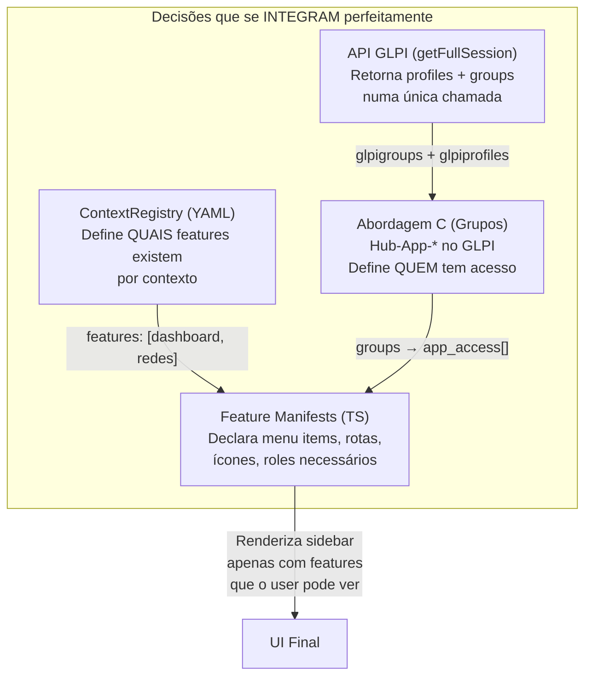
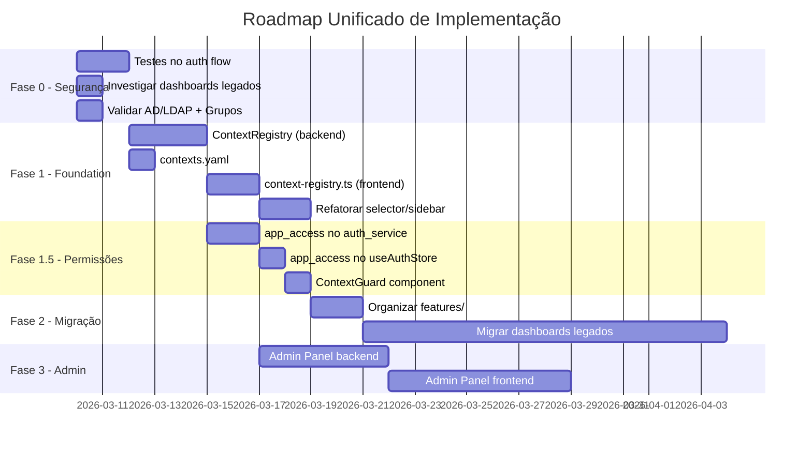

# 🧠 Reflexão & Consolidação — O Que Sabemos, O Que Falta, Por Onde Começar

> **Data**: 2026-03-09  
> **Base**: 4 documentos de estudo (~1.700 linhas), código-fonte auditado  
> **Objetivo**: Identificar gaps de conhecimento antes de iniciar implementação

---

## 1. O Que Já Sabemos e Está Decidido ✅

| Decisão | Fonte | Confiança |
|---------|-------|:---------:|
| Arquitetura: **Monólito Extensível** (Opção A) | [arquitetura_multi_contexto.md](file:///c:/Users/jonathan-moletta/.gemini/antigravity/playground/tensor-aurora/arquitetura_multi_contexto.md) | ⭐⭐⭐⭐⭐ |
| Backend: **ContextRegistry** substitui if/elif hardcoded | [arquitetura_multi_contexto.md](file:///c:/Users/jonathan-moletta/.gemini/antigravity/playground/tensor-aurora/arquitetura_multi_contexto.md) | ⭐⭐⭐⭐⭐ |
| Frontend: **Feature Manifests** declarativos | [arquitetura_multi_contexto.md](file:///c:/Users/jonathan-moletta/.gemini/antigravity/playground/tensor-aurora/arquitetura_multi_contexto.md) | ⭐⭐⭐⭐⭐ |
| Permissões: **Abordagem C** (Grupos Hub-App-* como Tags) | [estudo_permissoes_glpi.md](file:///c:/Users/jonathan-moletta/.gemini/antigravity/playground/tensor-aurora/estudo_permissoes_glpi.md) | ⭐⭐⭐⭐ |
| API GLPI: Mapeada e testada no sandbox | [relatorio_integracao_glpi.md](file:///c:/Users/jonathan-moletta/.gemini/antigravity/playground/tensor-aurora/relatorio_integracao_glpi.md) | ⭐⭐⭐⭐⭐ |
| Inventário: 11 aplicações mapeadas (5 no Hub, 4 legadas, 1 prevista) | [arquitetura_multi_contexto.md](file:///c:/Users/jonathan-moletta/.gemini/antigravity/playground/tensor-aurora/arquitetura_multi_contexto.md) | ⭐⭐⭐⭐⭐ |

### Descoberta Importante

O [auth_service.py](file:///c:/Users/jonathan-moletta/.gemini/antigravity/playground/tensor-aurora/app/services/auth_service.py) já possui **~60% da infraestrutura** para a Abordagem C:
- [fallback_login()](file:///c:/Users/jonathan-moletta/.gemini/antigravity/playground/tensor-aurora/app/services/auth_service.py#164-258) já chama [get_sub_items("User", id, "Profile_User")](file:///c:/Users/jonathan-moletta/.gemini/antigravity/playground/tensor-aurora/app/core/glpi_client.py#217-240) e [get_sub_items("User", id, "Group_User")](file:///c:/Users/jonathan-moletta/.gemini/antigravity/playground/tensor-aurora/app/core/glpi_client.py#217-240)
- O que **falta** é filtrar os grupos por prefixo `Hub-App-*` e retornar `app_access[]`
- O [useAuthStore.ts](file:///c:/Users/jonathan-moletta/.gemini/antigravity/playground/tensor-aurora/web/src/store/useAuthStore.ts) precisa apenas de um campo `app_access: string[]` na interface [AuthMeResponse](file:///c:/Users/jonathan-moletta/.gemini/antigravity/playground/tensor-aurora/web/src/store/useAuthStore.ts#24-35)

> [!TIP]
> Isso significa que a Abordagem C **não é uma reescrita** — é uma **adição incremental** de ~30 linhas no auth_service e ~5 linhas no store.

---

## 2. Gaps Identificados — O Que Ainda NÃO Sabemos

### 🔴 Gap 1: Tech Stack dos Dashboards Legados

| Dashboard | Porta | Sabemos? | Impacto |
|-----------|:-----:|:--------:|---------|
| Dashboard DTIC (Métricas/Heatmap) | 4003 | ❌ | Fase 2 do roadmap depende disso |
| Dashboard Manutenção/Conservação | 4010 | ❌ | Idem |
| Observabilidade (SOC/Rede/Ativos) | 5175 | ❌ | Fase 3 do roadmap |
| Governança (Normas/KPIs/RACI) | 4010 | ❌ | Fase 3 do roadmap |

**Pergunta**: São apps React/Vite standalone? Flask? HTML estático? Como se conectam ao backend de dados?

**Por que importa**: Se forem React/Vite, a migração para `features/` é mecânica (copiar componentes). Se forem Flask/HTML, precisamos reescrever. A estimativa de tempo das Fases 2-3 depende totalmente disso.

**Ação necessária**: Investigar as portas e o código-fonte desses apps.

---

### 🔴 Gap 2: AD/LDAP × Grupos Hub-App-*

**Situação atual**: Os usuários são importados do Active Directory via LDAP sync para o GLPI. 

**Pergunta**: Os grupos do GLPI são sincronizados automaticamente com os grupos do AD? Se criarmos `Hub-App-Redes` no GLPI, precisamos:
- (a) Vincular manualmente cada usuário via API/interface do GLPI? 
- (b) Ou podemos criar grupos correspondentes no AD e o sync automático faz a vinculação?

**Por que importa**: Se for (a), precisamos da tela de Admin Panel para gerenciar. Se for (b), o gerenciamento é feito pelo time de infra no AD.

**Ação necessária**: Verificar a regra de importação LDAP no GLPI de produção (`Administração > Regras > Regras de autorização`).

---

### 🟡 Gap 3: Testes no Auth Flow

**Estado atual**: Apenas 2 testes existentes (ambos no charger_service). O fluxo de autenticação — **a parte mais crítica e mais delicada de refatorar** — não tem **nenhum teste**.

**Risco**: Refatorar [auth_service.py](file:///c:/Users/jonathan-moletta/.gemini/antigravity/playground/tensor-aurora/app/services/auth_service.py) sem testes é como trocar motor com carro andando.

**Ação necessária**: Antes de qualquer refatoração, criar testes unitários para:
- [resolve_hub_roles()](file:///c:/Users/jonathan-moletta/.gemini/antigravity/playground/tensor-aurora/app/services/auth_service.py#53-109) — validar saída para cada combinação de context/profiles/groups
- [build_login_response()](file:///c:/Users/jonathan-moletta/.gemini/antigravity/playground/tensor-aurora/app/services/auth_service.py#111-162) — validar parsing do session_info
- Esses 2 testes sozinhos criam uma rede de segurança para a refatoração

---

### 🟡 Gap 4: Camada de Segurança — Credentials em Memória

O `useAuthStore` guarda `_credentials: {username, password}` em memória (Zustand) durante a sessão inteira. Apesar de não ser persistido no localStorage, fica exposto para XSS.

**Ação necessária**: Considerar trocar para token HTTP-only cookie ou eliminar a necessidade de re-autenticação cross-contexto.

---

## 3. Integração dos Documentos — O Que Converge e O Que Tensiona

### ✅ Convergência Natural

**A integração é limpa**: O YAML define o "catálogo", os Grupos definem o "acesso", o Manifest renderiza o "resultado".

### ⚠️ Ponto de Atenção: profile_map vs Abordagem C

O `contexts.yaml` proposto tem `profile_map` que mapeia `profile_id → hubRole`. A Abordagem C usa **grupos** para controlar acesso a apps. São coisas **diferentes que se complementam**:

| Conceito | O que controla | Fonte |
|----------|---------------|-------|
| `profile_map` no YAML | Qual **rol funcional** (solicitante/técnico/gestor) o user tem no Hub | Perfil GLPI nativo |
| `Hub-App-*` grupos | Quais **aplicações** o user pode acessar | Grupo GLPI |

**Não há conflito** — um user pode ser "técnico" (via profile) e ter acesso a "App Redes" + "App Dashboard" (via grupos). São camadas ortogonais.

---

## 4. Roadmap Unificado — A Sequência Mais Segura

### Fase 0 — Preparação (1-2 dias) `ANTES de qualquer código`
- [ ] Criar testes para [resolve_hub_roles()](file:///c:/Users/jonathan-moletta/.gemini/antigravity/playground/tensor-aurora/app/services/auth_service.py#53-109) e [build_login_response()](file:///c:/Users/jonathan-moletta/.gemini/antigravity/playground/tensor-aurora/app/services/auth_service.py#111-162) — rede de segurança
- [ ] Investigar tech stack dos dashboards legados (portas 4003, 4010, 5175)
- [ ] Verificar regras LDAP no GLPI de produção (grupos automáticos ou manuais?)

### Fase 1 — Foundation (1 semana) `Refatoração estrutural`
- [ ] Criar `ContextRegistry` + `contexts.yaml` no backend
- [ ] Substituir if/elif em config.py, health.py, session_manager.py, database.py
- [ ] Mover profile_maps de auth_service.py para contexts.yaml
- [ ] Criar `context-registry.ts` + `CONTEXT_MANIFESTS[]` no frontend
- [ ] Refatorar selector → renderiza do manifest
- [ ] Refatorar AppSidebar + navigation → resolve do manifest
- [ ] Refatorar [context]/layout.tsx → theme do manifest

### Fase 1.5 — Permissões App-Level (2-3 dias) `Incremental sobre Fase 1`
- [ ] Adicionar resolução de `app_access[]` via `Hub-App-*` groups em auth_service.py
- [ ] Adicionar `app_access` na interface [AuthMeResponse](file:///c:/Users/jonathan-moletta/.gemini/antigravity/playground/tensor-aurora/web/src/store/useAuthStore.ts#24-35) (backend + frontend)
- [ ] Criar `ContextGuard` component para proteção de rota por feature
- [ ] Criar grupos `Hub-App-*` de teste no GLPI de produção

### Fase 2 — Feature Migration (2-4 semanas) `Depende da Fase 0`
- [ ] Organizar `features/` no frontend
- [ ] Migrar dashboards legados (estratégia depende da tech stack descoberta)
- [ ] Migrar governança e observabilidade

### Fase 3 — Admin Panel (1-2 semanas) `Módulo novo`
- [ ] Backend: 9 endpoints de gestão de permissões
- [ ] Frontend: Interface de checkbox matrix
- [ ] Vincular ao GLPI via Group_User e Profile_User

---

## 5. Decisões Que Precisam Ser Tomadas

| # | Decisão | Opções | Quando |
|:-:|---------|--------|--------|
| 1 | **Onde vive o contexts.yaml?** | (a) Arquivo no repo (b) Variáveis de ambiente (c) Banco de dados | Fase 1 |
| 2 | **Grupos Hub-App-* são gerenciados por quem?** | (a) Admin do GLPI na interface nativa (b) Nosso Admin Panel via API (c) Sync do AD | Fase 1.5 |
| 3 | **Migrar dashboards legados ou reescrever?** | Depende da tech stack (Gap 1) | Fase 2 |
| 4 | **ContextGuard redireciona para onde quando negado?** | (a) 404 (b) Página de "Acesso Negado" (c) Redirect para home do contexto | Fase 1.5 |
| 5 | **Admin Panel: quem tem acesso?** | (a) Apenas Super-Admin GLPI (b) Qualquer gestor (c) Novo perfil "Hub-Admin" | Fase 3 |

---

## 6. Riscos e Mitigações

| Risco | Probabilidade | Impacto | Mitigação |
|-------|:-----:|:-----:|-----------|
| Refatoração do auth quebre login existente | Média | 🔴 Alto | Testes na Fase 0 + feature branch |
| Dashboards legados em tech incompatível | Média | 🟡 Médio | Investigar ANTES (Fase 0) |
| LDAP não sincroniza grupos Hub-App-* | Alta | 🟡 Médio | Gerenciar via Admin Panel (Fase 3) |
| Scope creep: tentar fazer tudo de uma vez | Alta | 🔴 Alto | Fase 0→1→1.5 é incremental e entrega valor |
| Perda de funcionalidade durante migração | Baixa | 🔴 Alto | Fases são aditivas, não destrutivas |

---

## 7. Resposta à Pergunta Central

> *"Não faço a menor ideia de como vamos implementar tudo isso... não faço a menor ideia de onde começar e se vamos terminar melhor do que começamos."*

### Por Onde Começar
**Fase 0** — é de 1-2 dias e não toca em código de produção. Cria testes + coleta informação que falta.

### Como Garantir Que Terminarmos Melhor
Cada fase **entrega valor independente** e é **compatível com o que existe**:
- Fase 1 (ContextRegistry) → elimina 15 pontos hardcoded, mas o sistema continua funcionando identicamente
- Fase 1.5 (app_access) → adiciona controle de acesso granular, mas quem já tinha acesso continua tendo
- Fase 2 (dashboards) → traz apps legados para dentro, mas os legados continuam rodando em paralelo durante a migração

**A regra de ouro**: Nenhuma fase é destrutiva. Todo passo é reversível com `git revert`.
