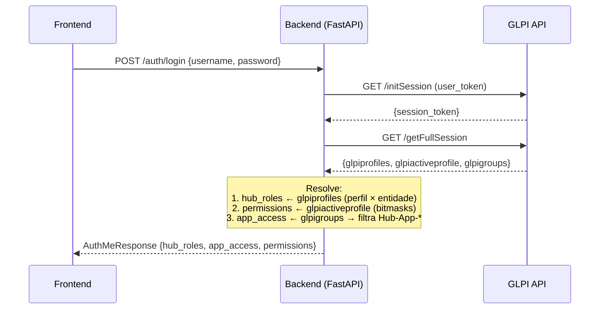
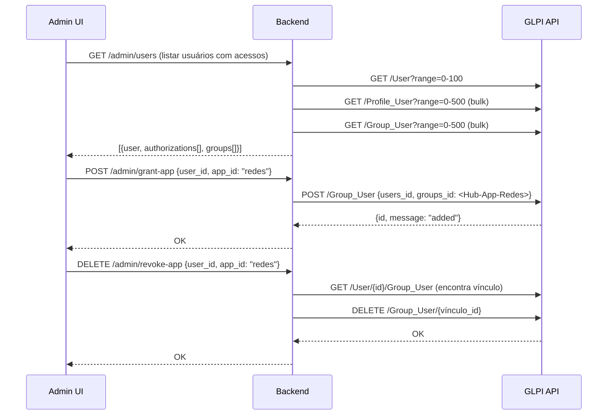

# 🔌 Relatório de Integração — API GLPI para Interface Própria de Gestão de Acessos

> **Data**: 2026-03-09 | **Sandbox**: `testecau.us4.glpi-network.cloud`  
> **Objetivo**: Mapeamento exaustivo da API para construir interface de administração de permissões

---

## 1. Mapeamento de Metadados e Estruturas de Pesquisa

### 1.1 O Endpoint `listSearchOptions/{ItemType}`

Este é o endpoint que responde: *"Quais são todos os campos e propriedades do objeto X e como posso filtrá-los?"*

```bash
GET /apirest.php/listSearchOptions/{ItemType}
```

Retorna um dicionário onde cada chave numérica é um **campo pesquisável** com metadados completos:

```json
{
  "1": {
    "name": "Name",                          // Label humano
    "table": "glpi_profiles",                // Tabela SQL origem
    "field": "name",                         // Coluna SQL
    "datatype": "itemlink",                  // Tipo de dado para renderização
    "uid": "Profile.name"                    // Identificador único global
  },
  "2": {
    "name": "ID",
    "table": "glpi_profiles",
    "field": "id",
    "datatype": "number"
  },
  // Seções são strings simples:
  "common": "Characteristics",
  "ticket": "Assistance"
}
```

### 1.2 Tipos de Dado Descobertos (`datatype`)

| datatype | Significado | Uso na UI |
|----------|------------|-----------|
| `string` | Texto livre | Input text |
| `number` | Inteiro | Input number |
| `bool` | Booleano | Toggle/checkbox |
| `dropdown` | FK para outra tabela | Select/combobox |
| `itemlink` | Link para item (com URL) | Link clicável |
| `datetime` | Data/hora | Date picker |
| `email` | E-mail | Input email |
| [text](file:///c:/Users/jonathan-moletta/.gemini/antigravity/playground/tensor-aurora/web/src/app/%5Bcontext%5D/layout.tsx#8-33) | Texto longo | Textarea |
| `count` | Contagem agregada | Display only |
| **`right`** | **Bitmask de permissão** | **Checkbox matrix** |
| `specific` | Tipo especial (enum) | Custom render |
| `language` | Código de idioma | Select idioma |

> [!IMPORTANT]
> O datatype `right` é **a chave para a checkbox matrix**. Campos com este tipo armazenam permissões como bitmask na tabela `glpi_profilerights`. Encontramos **~120 campos** desse tipo no Profile.

### 1.3 Descobertas por ItemType

| ItemType | Campos Pesquisáveis | Destaque |
|----------|:--:|----------|
| **Profile** | ~175 | ~120 campos `right` em `glpi_profilerights` (1 por funcionalidade GLPI) |
| **User** | ~45 | Inclui JOINs automáticos para Profile(20), Entity(80), Groups(13) |
| **Entity** | ~30 | Campos hierárquicos: `completename`, `entities_id` (pai), `level` |
| **Group** | ~20 | Campos: `entities_id`, `is_recursive`, `completename` |
| **Profile_User** | ~10 | Campos: `users_id`, `profiles_id`, `entities_id`, `is_recursive` |
| **Group_User** | ~8 | Campos: `users_id`, `groups_id`, `is_manager`, `is_userdelegate` |

### 1.4 Usando listSearchOptions para Buscas Avançadas (Search API)

O `listSearchOptions` não é só metadado — é o **schema do endpoint de busca avançada**:

```bash
# Buscar todos os usuários cujo perfil contém "Tecnico" no nome (campo 20)
GET /apirest.php/search/User?criteria[0][field]=20&criteria[0][searchtype]=contains&criteria[0][value]=Tecnico&forcedisplay[0]=20&forcedisplay[1]=80

# campo 20 = "Profiles (Entity)" → tabela glpi_profiles, campo name
# campo 80 = "Entities (Profile)" → tabela glpi_entities, campo completename
```

Cada número no `criteria[N][field]` corresponde exatamente à chave do `listSearchOptions`.

---

## 2. CRUD Exaustivo — Endpoints para Interface de Gestão de Acessos

### 2.1 Mapa Completo de Endpoints

```
Headers obrigatórios em TODAS as chamadas:
  App-Token: {app_token}
  Session-Token: {session_token}     ← obtido via initSession
  Content-Type: application/json     ← para POST/PUT/PATCH
```

#### Sessão e Contexto

| Ação | Método | Endpoint | Retorno |
|------|--------|----------|---------|
| Iniciar sessão | GET | `/initSession` | `{"session_token": "..."}` |
| Perfis do user logado | GET | `/getMyProfiles` | Perfis + entidades vinculadas |
| Entidades do user logado | GET | `/getMyEntities` | Entidades acessíveis |
| Sessão completa | GET | `/getFullSession` | **Toda a sessão** (permissões, entidades, config) |
| Trocar perfil ativo | POST | `/changeActiveProfile` | `{"profiles_id": N}` |
| Trocar entidade ativa | POST | `/changeActiveEntities` | `{"entities_id": N, "is_recursive": true}` |
| Encerrar sessão | GET | `/killSession` | — |

#### CRUD de Objetos

| Objeto | Listar | Ler | Criar | Atualizar | Deletar | Purgar |
|--------|--------|-----|-------|-----------|---------|--------|
| **User** | `GET /User` | `GET /User/{id}` | `POST /User` | `PUT /User/{id}` | `DELETE /User/{id}` | `DELETE /User/{id}?force_purge=1` |
| **Profile** | `GET /Profile` | `GET /Profile/{id}` | `POST /Profile` | `PUT /Profile/{id}` | — | — |
| **Entity** | `GET /Entity` | `GET /Entity/{id}` | `POST /Entity` | `PUT /Entity/{id}` | — | — |
| **Group** | `GET /Group` | `GET /Group/{id}` | `POST /Group` | `PUT /Group/{id}` | `DELETE /Group/{id}` | — |

#### Pivot Tables (Vinculações) ⭐

| Vínculo | Endpoint | Campos do Payload |
|---------|----------|-------------------|
| **Perfil ↔ Usuário ↔ Entidade** | `POST /Profile_User` | `{"users_id", "profiles_id", "entities_id", "is_recursive"}` |
| **Grupo ↔ Usuário** | `POST /Group_User` | `{"users_id", "groups_id", "is_manager", "is_userdelegate"}` |
| **Listar vínculos de user** | `GET /User/{id}/Profile_User` | Retorna array de autorizações |
| **Listar vínculos de user** | `GET /User/{id}/Group_User` | Retorna array de memberships |
| **Remover autorização** | `DELETE /Profile_User/{id}` | Remove vínculo perfil/entidade |
| **Remover do grupo** | `DELETE /Group_User/{id}` | Remove do grupo |

### 2.2 Payloads Reais Testados e Validados

#### Profile_User — Estrutura completa de resposta

```bash
GET /User/2/Profile_User
```
```json
[{
  "id": 2,                    // ID do vínculo (Profile_User)
  "users_id": 2,              // ID do usuário
  "profiles_id": 4,           // ID do perfil (Super-Admin)
  "entities_id": 0,           // ID da entidade (Root)
  "is_recursive": 1,          // Herda para filhas? 1=sim
  "is_dynamic": 0,            // Veio de regra automática? 0=manual
  "is_default_profile": 0,    // É o perfil padrão do user?
  "links": [
    {"rel": "User", "href": ".../User/2"},
    {"rel": "Profile", "href": ".../Profile/4"},
    {"rel": "Entity", "href": ".../Entity/0"}
  ]
}]
```

#### Group_User — Estrutura completa de resposta

```bash
GET /User/2/Group_User
```
```json
[{
  "id": 1,                    // ID do vínculo
  "users_id": 2,              // ID do usuário
  "groups_id": 1,             // ID do grupo (N3 Redes)
  "is_dynamic": 0,            // Automático via regra?
  "is_manager": 0,            // É gerente do grupo?
  "is_userdelegate": 0,       // É delegado do grupo?
  "links": [
    {"rel": "User", "href": ".../User/2"},
    {"rel": "Group", "href": ".../Group/1"}
  ]
}]
```

### 2.3 Parâmetros de Query Úteis

| Parâmetro | Uso | Exemplo |
|-----------|-----|---------|
| `range=0-50` | Paginação | `GET /User?range=0-50` |
| `expand_dropdowns=true` | Expande FKs para nomes | Mostra `"profiles_id": "Super-Admin"` |
| `with_logs=true` | Inclui histórico | Para auditoria |
| `add_keys_names=[]` | Adiciona nomes dos campos | Metadados das chaves |
| `searchText[field]=value` | Filtro rápido | `GET /User?searchText[name]=admin` |
| `sort=N&order=ASC` | Ordenação por campo | N = ID do campo em listSearchOptions |

---

## 3. Extração da Árvore de Permissões (Checkbox Matrix)

### 3.1 Decodificação de Bitmasks

O GLPI armazena permissões CRUD como **bitmasks inteiros**. Cada bit representa uma permissão:

| Bit | Valor | Permissão | Significado |
|-----|------:|-----------|-------------|
| 0 | 1 | `READ` | Pode visualizar |
| 1 | 2 | `UPDATE` | Pode editar |
| 2 | 4 | `CREATE` | Pode criar |
| 3 | 8 | `DELETE` | Pode mover para lixeira |
| 4 | 16 | `PURGE` | Pode deletar definitivamente |
| 5 | 32 | `READ_NOTES` | Pode ler notas |
| 6 | 64 | `UPDATE_NOTES` | Pode editar notas |
| 7 | 128 | `UNLOCK` | Pode desbloquear (específico) |
| 11 | 2048 | `ASSIGN` | Pode atribuir a outros |
| 12 | 4096 | `STEAL` | Pode "roubar" atribuição |
| 13 | 8192 | `OWN` | Pode auto-atribuir |

**Exemplo de decodificação:**
```
ticket = 523295

523295 em binário = 1111111111110011111
→ READ(1) + UPDATE(2) + CREATE(4) + DELETE(8) + PURGE(16) 
  + ASSIGN(2048) + STEAL(4096) + OWN(8192)
  + bits extras para funcionalidades específicas de ticket
```

### 3.2 Onde os Bitmasks Estão Armazenados

Existem **duas fontes** para ler as permissões de um perfil:

#### Fonte 1: `getFullSession` → `glpiactiveprofile`
Retorna as permissões do **perfil ativo** da sessão como dict plano:

```json
{
  "glpiactiveprofile": {
    "id": 4,
    "name": "Super-Admin",
    "interface": "central",
    "ticket": 523295,           // Bitmask de ticket
    "followup": 64535,          // Bitmask de followup
    "computer": 4095,           // Bitmask de computer
    "profile": 23,              // Bitmask de gestão de perfis
    "user": 15519,              // Bitmask de gestão de users
    "entity": 3327,             // Bitmask de gestão de entidades
    "group": 119,               // Bitmask de gestão de grupos
    // ... ~90 campos de permissão
  }
}
```

#### Fonte 2: `GET /Profile/{id}` (Direto)
Retorna o perfil com **todos os campos**, incluindo metadados + permissões:

```bash
GET /Profile/6   # Technician
# Campos não-null do Technician:
{
  "name": "Technician",
  "interface": "central",
  "helpdesk_hardware": 3,
  "helpdesk_item_type": "[\"Computer\",\"Monitor\"...]",
  "ticket_status": "{...}",           // Mapa de transições de status permitidas
  "use_mentions": 1
}
```

> [!WARNING]
> O `GET /Profile/{id}` **não retorna as permissões bitmask diretamente** (elas estão na tabela `glpi_profilerights`, não em `glpi_profiles`). Para obter as permissões de um perfil que não é o ativo, use a **Search API** ou mude o perfil ativo via `changeActiveProfile`.

### 3.3 Sequência de Calls para Montar a Checkbox Matrix

Para construir uma tela "*Quem pode acessar o quê*":

```
PASSO 1: Listar todos os usuários
  GET /User?range=0-100&searchText[is_active]=1
  → [{id, name, realname, firstname}, ...]

PASSO 2: Para cada usuário, buscar autorizações
  GET /User/{id}/Profile_User
  → [{profiles_id, entities_id, is_recursive}, ...]

PASSO 3: Para cada usuário, buscar grupos
  GET /User/{id}/Group_User
  → [{groups_id, is_manager}, ...]

PASSO 4: Enriquecer com nomes
  GET /Profile/{profiles_id}   → nome do perfil
  GET /Entity/{entities_id}    → nome + completename da entidade
  GET /Group/{groups_id}       → nome + entidade do grupo

RESULTADO: Matriz completa
  User "João" →
    Autorizações: [
      {profile: "Technician", entity: "DTIC", recursive: true},
      {profile: "Self-Service", entity: "SIS", recursive: false}
    ]
    Grupos: [
      {group: "Hub-App-Redes", is_manager: false},
      {group: "N3 Redes", is_manager: true}
    ]
```

**Otimização com expand_dropdowns:**
```bash
# Uma única chamada que já resolve os nomes:
GET /Profile_User?expand_dropdowns=true&searchText[users_id]=2
# Retorna profiles_id="Super-Admin", entities_id="Root entity"
```

### 3.4 Como `getFullSession` é Nosso Melhor Amigo no Login

No fluxo de login do nosso frontend, **`getFullSession` é O endpoint mais importante**:

```
1. POST /initSession → session_token
2. GET /getFullSession → {
     session: {
       glpiID: 2,                  // User ID
       glpiname: "admin",          // Username
       
       // ★ PERFIS COM ENTIDADES (para resolver hub_roles)
       glpiprofiles: {
         "4": {
           "name": "Super-Admin",
           "entities": [{"id": 0, "name": "Root entity", "is_recursive": 1}]
         },
         "6": {
           "name": "Technician",
           "entities": [{"id": 2, "name": "DTIC", "is_recursive": 0}]
         }
       },
       
       // ★ PERMISSÕES CRUD DO PERFIL ATIVO (para filtrar features)
       glpiactiveprofile: {
         "ticket": 15519,
         "knowbase": 15383,
         "profile": 23,
         // ... checkbox matrix inteira
       },
       
       // ★ ENTIDADES ATIVAS (para escopo de dados)
       glpiactiveentities_string: "'0','1','2','4','5'",
       
       // ★ GRUPOS DO USUÁRIO (para resolver app_access)
       glpigroups: [1, 2]   // IDs dos grupos
     }
   }
```

**Com UMA chamada** temos tudo para resolver: roles, permissões, entidades e apps.

---

## 4. Prova de Conceito — Scripts Práticos

### 4.1 Script: Montar Matriz Completa de um Usuário

```bash
#!/bin/bash
# Uso: ./user_matrix.sh <session_token> <user_id>
BASE="https://testecau.us4.glpi-network.cloud/apirest.php"
H1="App-Token: xpvj0QBuDibmNDQPGTo0IjYREeL75gdi6o0607Bx"
H2="Session-Token: $1"
UID=$2

echo "=== AUTORIZAÇÕES (Perfil × Entidade) ==="
curl -s -H "$H1" -H "$H2" "$BASE/User/$UID/Profile_User?expand_dropdowns=true"

echo -e "\n=== GRUPOS ==="
curl -s -H "$H1" -H "$H2" "$BASE/User/$UID/Group_User?expand_dropdowns=true"

echo -e "\n=== PERFIS DISPONÍVEIS ==="
curl -s -H "$H1" -H "$H2" "$BASE/getMyProfiles"
```

### 4.2 Script: Vincular Usuário a Grupo-Aplicação

```bash
# Conceder acesso ao App Redes para o usuário 7
curl -X POST \
  -H "App-Token: xpvj0QBuDibmNDQPGTo0IjYREeL75gdi6o0607Bx" \
  -H "Session-Token: mu10krdhso4co0pso3a04aothr" \
  -H "Content-Type: application/json" \
  -d '{"input":{"users_id":7,"groups_id":1}}' \
  "https://testecau.us4.glpi-network.cloud/apirest.php/Group_User"
# {"id":2,"message":"Item successfully added"}
```

### 4.3 Script: Conceder Autorização (Perfil em Entidade)

```bash
# Dar perfil Technician(6) ao user 7 na entidade DTIC(2), recursivo
curl -X POST \
  -H "App-Token: ..." -H "Session-Token: ..." \
  -H "Content-Type: application/json" \
  -d '{"input":{
    "users_id": 7,
    "profiles_id": 6,
    "entities_id": 2,
    "is_recursive": 1
  }}' \
  "https://.../apirest.php/Profile_User"
```

### 4.4 Script: Revogar Acesso (Remover de Grupo)

```bash
# Primeiro, descobrir o ID do vínculo
curl -s -H "..." "https://.../apirest.php/User/7/Group_User"
# Retorna: [{"id": 2, "groups_id": 1, ...}]

# Depois, deletar o vínculo pelo ID
curl -X DELETE -H "..." \
  "https://.../apirest.php/Group_User/2"
```

### 4.5 Busca Avançada: Usuários por Perfil e Entidade

```bash
# Quais usuários têm perfil Technician na entidade DTIC?
curl -s -H "..." \
  "https://.../apirest.php/search/User?\
criteria[0][field]=20&criteria[0][searchtype]=contains&criteria[0][value]=Technician&\
criteria[1][field]=80&criteria[1][searchtype]=contains&criteria[1][value]=DTIC&\
criteria[1][link]=AND&\
forcedisplay[0]=1&forcedisplay[1]=34&forcedisplay[2]=20&forcedisplay[3]=80"

# campo 20 = Profiles (Entity) → nome do perfil
# campo 80 = Entities (Profile) → nome da entidade
# forcedisplay = quais colunas retornar
```

---

## 5. Resultados da Varredura do Sandbox

### 5.1 Dados Criados para Teste

| Tipo | ID | Nome | Pai/Entidade |
|------|:--:|------|:--:|
| Entity | 0 | Root entity | — |
| Entity | 1 | Casa Civil RS | 0 |
| Entity | 2 | DTIC | 1 |
| Entity | 3 | SIS | 1 |
| Entity | 4 | App Redes | 2 |
| Entity | 5 | App Gestão KPI | 2 |
| Entity | 6 | Manutenção | 3 |
| Entity | 7 | Conservação | 3 |
| Group | 1 | N3 Redes | Entity 2 (DTIC) |
| Group | 2 | Suporte Geral DTIC | Entity 2 |
| Group | 3 | CC-Manutencao | Entity 3 (SIS) |
| Group | 4 | CC-Conservacao | Entity 3 |
| Profile | 9 | Hub-Monitor | — |

### 5.2 Bitmasks de Permissão Decodificados (Super-Admin)

Amostra das ~90 permissões extraídas de `getFullSession.glpiactiveprofile`:

| Objeto GLPI | Bitmask | Permissões Decodificadas |
|-------------|--------:|--------------------------|
| [ticket](file:///c:/Users/jonathan-moletta/.gemini/antigravity/playground/tensor-aurora/app/services/ticket_list_service.py#34-164) | 523295 | READ, UPDATE, CREATE, DELETE, PURGE, ASSIGN, STEAL, OWN |
| [user](file:///c:/Users/jonathan-moletta/.gemini/antigravity/playground/tensor-aurora/app/routers/domain_auth.py#53-91) | 15519 | READ, UPDATE, CREATE, DELETE, PURGE, 128, ASSIGN, STEAL, OWN |
| [entity](file:///c:/Users/jonathan-moletta/.gemini/antigravity/playground/tensor-aurora/app/routers/domain_auth.py#20-51) | 3327 | READ, UPDATE, CREATE, DELETE, PURGE, NOTES_R, NOTES_W, 128, ASSIGN |
| [profile](file:///c:/Users/jonathan-moletta/.gemini/antigravity/playground/tensor-aurora/app/core/glpi_client.py#95-104) | 23 | READ, UPDATE, CREATE, PURGE |
| `group` | 119 | READ, UPDATE, CREATE, PURGE, NOTES_R, NOTES_W |
| `computer` | 4095 | READ, UPDATE, CREATE, DELETE, PURGE, NOTES_R, NOTES_W, 128, ASSIGN |
| `knowbase` | 15383 | READ, UPDATE, CREATE, PURGE, ASSIGN, STEAL, OWN |
| `followup` | 64535 | READ, UPDATE, CREATE, PURGE, ASSIGN, STEAL, OWN |
| `planning` | 3073 | READ, ASSIGN |
| `reports` | 1 | READ only |
| `statistic` | 1 | READ only |
| `logs` | 1 | READ only |

---

## 6. Arquitetura de Endpoints — Mastigada para Implementação

### Fluxo de Login (auth_service.py aprimorado)



### Fluxo de Admin Panel (nova tela)



### Endpoints Nossos a Construir

| Endpoint Nosso | Ação | Calls GLPI Internamente |
|----------------|------|------------------------|
| `GET /admin/users` | Lista users com matrix | `User` + `Profile_User` + `Group_User` |
| `GET /admin/users/{id}/access` | Detalhes de um user | `User/{id}/Profile_User` + `User/{id}/Group_User` |
| `POST /admin/users/{id}/authorization` | Concede Perfil×Entidade | `POST Profile_User` |
| `DELETE /admin/users/{id}/authorization/{pu_id}` | Revoga autorização | `DELETE Profile_User/{pu_id}` |
| `POST /admin/users/{id}/app-access` | Concede acesso a app | `POST Group_User` |
| `DELETE /admin/users/{id}/app-access/{gu_id}` | Revoga acesso a app | `DELETE Group_User/{gu_id}` |
| `GET /admin/profiles` | Lista perfis disponíveis | `GET Profile` |
| `GET /admin/entities` | Lista entidades (árvore) | `GET Entity` |
| `GET /admin/groups` | Lista grupos disponíveis | `GET Group` |
