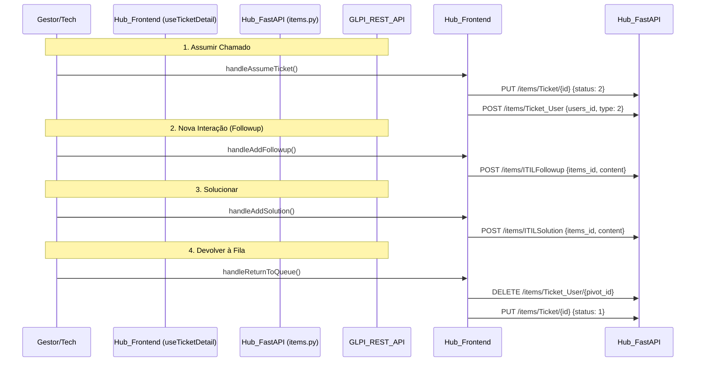

# Auditoria Técnica: Ciclo de Vida de Tickets (Workflow ITIL)

**Status:** Completed
**Escopo:** Módulo de Chamados — Modelo operacional, Fluxo de Estados, Transições, Permissões, e Integração com GLPI.

---

## 1. Mapeamento de Estados (Kanban vs GLPI)

O sistema Hub não cria uma máquina de estados própria no MySQL. Ele mapeia diretamente o ciclo ITIL padrão do GLPI. A fonte de verdade encontra-se em `TICKET_STATUS_MAP` (`types.ts`).

| Coluna Kanban / Operação | Status ID (GLPI) | Significado e Disparo |
| :--- | :--- | :--- |
| **NOVO** | `1` | Chamado aberto, nenhum grupo ou técnico assumiu. |
| **EM ATENDIMENTO** | `2` | Técnico assumiu (Ticket_User type 2 criado). Serviço em curso. |
| **PLANEJADO** | `3` | *Interno/Legado*. Existe no dicionário, mas nenhuma UI action do Hub dispara este status ativamente. |
| **PENDENTE** | `4` | Pausado aguardando terceiro ou feedback. SLA congelado (se configurado no GLPI). |
| **SOLUCIONADO** | `5` | `ITILSolution` registrada. Temporizador aguardando aceite do usuário ou limite automático (Config GLPI). |
| **FECHADO** | `6` | Encerrado permanentemente. Apenas consulta. |

## 2. Diagrama de Transições e Integração

Foi identificado que o **backend FastAPI age como um mero proxy (CRUD genérico em `items.py`)**. Toda a inteligência da máquina de estados do ticket está acoplada no hook de frontend `useTicketDetail.ts`.

> [!WARNING]
> Fazer mutações em cadeia pelo cliente React (`PUT Ticket` seguido de `POST Ticket_User` no `handleAssumeTicket`) **fere propriedades ACID**. Se a request de `Ticket_User` falhar por erro de rede pós-status, o Ticket fica gravado no banco GLPI como "Em Atendimento (2)" sem dono. A inteligência de domínio deve recuar para uma rota `POST /tickets/{id}/assume` no backend.

## 3. Matriz de Permissões Atual

As permissões (Visibility & Actions) na matriz operam via inspeção de Estado React e Claims no `useAuthStore`.

| Ação | Usuário Solicitante | Técnico | Gestor |
| :--- | :--- | :--- | :--- |
| **Visualizar (Read)** | Somente os próprios (`fetchMyTickets`) | Todos do seu Grupo | Todos |
| **Assumir** | ❌ | ✅ | ✅ |
| **Add Followup** | ❌ (Atualmente não visível no Hook sem refactoring) | ✅ | ✅ |
| **Solucionar** | ❌ | ✅ | ✅ |
| **Pausar/Retomar** | ❌ | ✅ (Apenas próprios) | ✅ Todos |
| **Devolver p/ Fila** | ❌ | ✅ (Apenas próprios) | ✅ Todos |
| **Transferir** | ❌ | ✅ (Apenas próprios) | ✅ Todos |

> O guard implementado no frontend é: `canActOnTicket = isGestor \|\| technicianUserId === currentUserId;`.

## 4. Auditoria de Decisões de Design (Prompt D1 a D7)

*   **D1: Um ticket pode ter mais de um técnico simultâneo?**
    *   *Estado atual:* O código GLPI tolera N associações. No entanto, o `useTicketDetail.ts` usa um `.find((u) => u.type === 2)` fixando design para o **primeiro match**. A transferência apaga apenas o primeiro registro.
    *   *Risco:* Dados corrompidos se a interface GLPI injetar dois técnicos no ticket.
*   **D2: Técnico assume -> exlusivo?**
    *   *Estado atual:* Sim. Técnicos comuns não podem modificar chamados atribuídos a outros (protegido pela verificação frontend).
*   **D3: Solicitante (Usuário) interage pelo Hub?**
    *   *Estado atual:* View de usuário exibe os tickets abertos, mas o Hook focado `useTicketDetail` está pesadamente inclinado a operações de Tech. O endpoint no BD (`ticket_list_service.py`) filtra os requesters de forma robusta.
*   **D4: O Solicitante requer aprovação antes da Solution ser Closed?**
    *   *Estado atual:* O Hub delega isso completamente. Ele apenas lança a classe `ITILSolution` no GLPI e confia no *Cron/Mail Receiver* nativo do GLPI para transitar 5 (Solucionado) para 6 (Fechado).
*   **D5: Reabertura Automática via Chat?**
    *   *Estado atual:* Não existe orquestrador que intercepte e-mails ou mensagens para reabrir via código Hub. O técnico deve reabrir ativamente via botão React.
*   **D6: O Status Planejado (3) é visível?**
    *   *Estado atual:* Declarado, mas omitido no workflow ativo.
*   **D7: A Solução entra na Base de Conhecimento (Knowledge)?**
    *   *Estado atual:* Endpoint `handleSolution()` gera apenas `ITILSolution`. Não há ponte ou gatilho com o roteador `knowledge.py` no Backend.

## 5. Recomendações Críticas

1. **Transaction Wrapping Backend:** Extrair os manipuladores de negócios de `web/src/components/ticket/useTicketDetail.ts` para funções Pydantic baseadas na API FastAPI. (e.g., uma Rota `POST /api/v1/.../tickets/{id}/workflow`). Isto mitiga o problema de "Transações Partial" feitas pelo browser HTTP concorrente.
2. **Definir Gateway de Retries Mutáveis:** O Hook HTTP `client` bate seco. Embora `glpi_client.py` use Tenacity para Retry, requests compostas no backend são um ponto forte para evitar "Status Ghost" (Estado sem assign).
3. **Mapeamento Explícito de Conhecimento (D7):** Implementar um Hook/Listener no Backend que escuta inserts em `ITILSolution` para transbordo automático via rota do `knowledge.py` associado ao GLPI FAQs.
